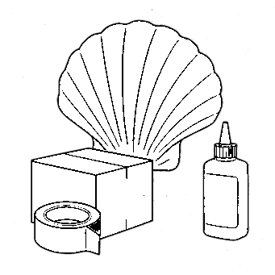
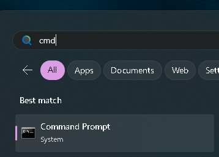

# Preface

---

<!-- Title -->
Using "ubiquitous_bash"

<!-- SubTitle - Informal Name-->
ALCHEMY Glue Book


<!--  -->


---


### **What you Gain from "ubiquitous_bash" .**

By getting started with "ubiquitous_bash", you can start with well-maintained commands proven to meet meet the needs of use cases and subsequent commands, letting you focus on the logic of your scripts and on exploring new platforms or projects.

You can hit the ground running even faster with "ubiquitous_bash" than without, and that little early investment will pay off in reliable, portable workflows—far more efficient than reinventing each part yourself.

The "ubiquitous_bash" framework gives a ready-made environment for stabilizing and experimenting with software from an easy-to-use interactive shell scripting chat window, or through the popular VSCode IDE, etc. Rather than iteratively figuring out and maintaining every parameter, workaround, and multi-step configuration yourself, you can immediately tap into conveniences that the project already provides:

- Cross-platform scripting – You can write once and run on Linux, or even MSWindows . Double click the exact same 'batch' file on UNIX/Linux and MSWindows to open a '_bash' terminal or run a function in your own shell script, calling whatever programs with any files and parameters you want.

- AI-assisted command-line, development, processing - CLI Codex available every command-line, sophisticated Codex prompts, with optional control of the sandbox harness that really works, nearly as capable as WebUI Codex on your local system to make things work no matter what.

- Local AI help and automation - Install and run the powerful 'Devstral-Small' model locally with Vision on 16GB VRAM (~20tokens/sec) or CPU . Developers can also have 'Llama-augment' (~60tokens/sec) agentically, locally, process pipelines. Never worry you won't have your AI programming helper with you, and get that download URL no matter how the format changes.

- Lightweight containment – Python “virtualization” and directory virtualization '_fakeHome' , 'abstractfs' , keep your environment tidy, separating applications, stabilizing file locations, without needing full-blown virtual machines.

- Full distribution/OperatingSystem builds or app-level virtualization – When you’re ready to just build your own custom distribution/OperatingSystem, _openChRoot to get started without fumbling loopback devices, and launch sandboxed applications with fileparameter translation under your favorite backend - _userVBox, _userQemu, _userChRoot, _userDocker , and more. Even DosBox and Wine installations can be kept portable and convenient.

- Limitless Inter-Process-Communication and pipelines – “Queue” and “MetaEngine” offer ad-hoc communication and multi-input-multi-output pipelines so you can string together commands in advanced ways. Be ready for a future of connecting applications to more applications.


### **What is bash ?**

#### What bash shell does.

The bash shell is essentially a chat program. It reads commands from you typing in a chat window called a 'terminal' or 'command prompt', or it reads commands from a script. Then the bash shell will call the OperatingSystem kernel (eg. Linux, or the MSWindows kernel) to run the program requested by that command.

All programs on a modern computer OperatingSystem are run this way: typing `'C:\Windows\explorer.exe'` at such a command-line shell on MSWindows can (if not already running) start the graphical shell, from which you get your 'Start Menu' . Equally, if you have typed `'C:\Program Files\Firefox\Firefox.exe'` as the command in the properties of a shortcut file, with the graphical shell you can double click that shortcut file, which will cause the graphical shell to ask the OperatingSystem kernel to run that program. As you may have guessed, just as command-line shells can run graphical shells, graphical shells can run command-line shells, which is usually how you get your interactive 'chat' window with a command-line shell such as bash.

You can also boot a computer directly to a command-line shell without a graphical shell, more than decades ago this was how most people used computers. In modern times, booting directly to only a command-line shell is something you don't need to worry about: in situations where this is common, such as with servers, or over a serial port to an experimental hardware device, you will be given simple, clear instructions to follow. Usually you will run a given command to run in your own bash shell, which will then connect your interactive 'chat' to 'talk' to that remote computer instead until you type the 'exit' command.

If you understood all that, then you can now imagine how the bash shell, a graphical shell, or any other graphical shell, is always running the same special binary instruction, which interrupts and asks the OperatingSystem kernel, to run a program at the file location and with parameters, defined entirely by the same short string of human readable text. Were you able to 'talk' the OperatingSystem kernel directly, you would be able to type out `'C:\Program Files\Firefox\Firefox.exe'` to run your web browser, equally the same as typing that at a shell, or double-clicking the relevant shortcut file in a graphical shell with the same text string. Note this does imply both command-line and graphical shells are something of a file manager: that is absolutely the case, most file managers are indeed shells capable of running programs equally the same way.

If the concept that a shell, both a command-line shell as well as a graphical shell, is merely a convenient user-friendly program, most often a file manager app, to ask the OperatingSystem kernel to run another program, still leaves you with some questions, then it is a good idea to ask those questions of an AI LLM .

One of the best free AI LLM chat services is OpenRouter .

[https://openrouter.ai/chat](https://openrouter.ai/chat)

Maybe the best AI LLM model to chat with about technical questions is the open model `Llama 3.1 Nemotron Ultra 253b` .

[https://openrouter.ai/chat?models=nvidia/llama-3.1-nemotron-ultra-253b-v1:free](https://openrouter.ai/chat?models=nvidia/llama-3.1-nemotron-ultra-253b-v1:free)

#### How to see a bash shell interactive 'chat'.

If you're using a Linux/UNIX computer distribution/OperatingSystem, open a program like 'xterm' or 'konsole', or just search for some program from a menu 'terminal'. If what you see now is a short string like `user@hostname: ~#` followed by a text cursor, where you can type a command such as `echo happy`, then in the vast majority of cases: you are looking at a `bash` interactive 'chat'. You can type all of the same commands here that you could write to a file named 'file.sh' and run as a program, and you have the full power of a Turing-complete programming language, in a language particularly designed to easily call other programs. You can even run graphical programs, such as your favorite web browser.

If you're using MSWindows, go to the start menu, search for something like 'cmd' or 'powershell', run that. Not quite bash, but another shell rather similar to bash, made for the same purpose. You can type a command such as `echo happy` here too, the difference is a bash shell has a lot of more useful commands and a much more convenient syntax for such things running one program after another. You can install a bash shell on MSWindows by quickly installing "extendedInterface" (an "ubiquitous_bash" based project) as explained under the next heading, and then you will be able to click a '_bash' shortcut to get a real bash shell, same as a Linux/UNIX computer.

```
user@hostname: ~# echo happy
happy
user@hostname: ~# _
```

<!--  -->

#### What to do with a bash shell.

If this seems intimidating, don't worry, there are only a few lines of code you will use often.

| Code | Description | Example |
| --- | --- | --- |
| /home/username | The directory /home/username . UNIX/Linux directories all start at `/` , much like `C:\` . | |
| ./ | The current directory . Often used to call a script. | ./ubiquitous_bash.sh |
| ../ | The parent directory . | cd ../ |
| cd | Change to a different directory. | cd /home/username ; cd |
| ls | List files in directory. | ls ./ |
| less | Read a file in a directory. Page up/down to scroll, q to quit. | less ./ubiquitous_bash.sh |
| git | Version control software. Saves, loads, downloads, uploads, newer and older versions of files in the current direct directory. | git status |

You can always ask an AI LLM model how to do something you want to do in a bash terminal. The vast majority if not all general purpose AI LLMs, even the smallest locally runnable AI LLMs such as Llama 3.1 8b, are perfectly reliable explaining and performing basic bash shell commands. This is because bash commands are extremely common in online discussions about computers, distributions/OperatingSystems, etc, and so will have been included in the basic predict-the-next-token pretraining used to give a basic understanding of human language to AI LLMs.

If you want to learn more about what distributions/OperatingSystems are, how a computer goes from power on, to BIOS/UEFI/firmware, to bootloader, to kernel, to init, to CLI shell or GUI shell, to graphical programs, to how bash shell commands call on the kernel to run programs the same way all programs are run under a distribution/OperatingSystem, then chatting with an AI LLM about each of these subjects is a fun and interactive way to learn.


### **What is "ubiquitous_bash" ?**

Mostly "ubiquitous_bash" is a set of helper functions for the bash shell. When you define a helper function in bash by typing something like this in an interactive 'chat' or script file:
```bash
_helperFunction() {
    echo "Hello world!" "$@"
}
```
You can call that function as a subsequent command in an interactive 'chat' or script file:
```bash
_helperFunction "Yay!"
```
Which will of course simply output this:
```
Hello world! Yay!
```

Mostly the "ubiquitous_bash" project just provides a lot of these functions, to reliably find and call other programs with the correct parameters.


You can install the self-contained "ubiquitous_bash" project (~50MB) which includes the ~2MB 'ubiquitous_bash.sh' script itself, on a UNIX/Linux computer just by downloading it. To download, just type another one of those interactive 'chat' commands:
```bash
git clone --recursive https://github.com/mirage335-colossus/ubiquitous_bash.git
```

You can make the functions available to type in your interactive shell, and also get the fancy colorful visualPrompt, by running the '_setupUbiquitous' function:
```bash
cd ./ubiquitous_bash.sh
./ubiquitous_bash.sh _setupUbiquitous
```


MSWindows users can install "ubiquitous_bash" simply by downloading and running the latest "extendedInterface" installer. Just make sure you have at least ~2GB free space on `"C:\"` . When done, you will find a `C:\_bash.bat` file which can open a bash interactive 'chat' window, and a shortcut file to it which you can pin to the Start menu.

[https://github.com/mirage335-colossus/extendedInterface/releases/download/build-15624422433-1/extIface.exe](https://github.com/mirage335-colossus/extendedInterface/releases/download/build-15624422433-1/extIface.exe)


### **What you need to know: proficiency - license to speedrun.**

Before proceeding to the tutorials, etc, you should have at least a basic proficiency with the bash shell, sufficient to navigate to subdirectories with `cd` , list files with `ls` , read a file with `less` , navigate to parent directories with `cd` , and run programs and scripts by calling `./script.sh` , and ideally it would be best to understand the use of `chmod u+x` as well .

If you haven't been able to get a bash shell working on your own computer, you can ask an AI LLM to 'Please pretend roleplay this is a bash shell terminal.' . An AI LLM model can be used to write a prompt to get an AI LLM model to do such roleplay. Beware the resulting roleplay may have some gaps and inaccuracies, but will almost always be highly consistent, more than sufficient to practice quickly exploring what is available in a command line environment.

Please write a prompt to get an AI LLM to roleplay a bash shell terminal.

Prompt:  
“You are now going to act as a Bash shell running on a typical Linux machine.  
• Begin every response with the prompt string `‘$ ’` (dollar-sign and a space).  
• Treat whatever I type after the prompt as a command entered at the terminal.  
• Return exactly what the real Bash interpreter would output for that command, followed by a new `‘$ ’` prompt on the next line, ready for more input.  
• If a command would normally produce no output, just show the next prompt.  
• Do not add commentary, explanations, or code fences—only the raw terminal output.  
• Assume standard Ubuntu-like defaults and that all common GNU utilities are installed.  
• If the command tries to access the internet, requires elevated privileges, or would be destructive, respond with the same error or permission message Bash would show.  
Begin when you read my first command.”

Although not all AI LLM models may be suitable for such roleplay, at least some open AI LLM models seem sufficiently consistent for shell practice.

[https://openrouter.ai/chat?models=meta-llama/llama-3.1-8b-instruct:free](https://openrouter.ai/chat?models=meta-llama/llama-3.1-8b-instruct:free)


### **What next?**

Assuming you have a basic proficiency, or you have an incredible motivation to jump in with the sharks (cheers to you!), then you can flip through this book to use "ubiquitous_bash" to:

- Get a more comfortable, intuitive, and powerful bash shell experience.

- Edit and run simpler bash shell scripts.

To put your mind at ease:

- No subtle global breakage, not going to prevent or break other installed software.

- Self-contained. Configuration, temporary files, if any, stay in same directory as the 'ubiquitous_bash.sh' script file.

You don't have to worry that messing with the bells and whistles of "ubiquitous_bash" will change some configuration option you won't be able to get back. A new copy of "ubiquitous_bash" is a new standalone, portable, copy. If you do edit or configure anything "ubiquitous_bash", it will be human readable plain-text, and it won't affect other software.

Since the "ubiquitous_bash" project is all about stability, any reported issues affecting other software will be treated as bugs. Ease-of-use is important too, so anything reported that could be more intuitive will get responded to as well.


# Formal Table Of Contents

1. [# Tutorials](#tutorials)

2. [Framework – Virtualization](#framework---virtualization)


# _Chapter1_ **Chatbot Help (yes it _really_ works!)**

Convenient AI 'chatbots' with some "ubiquitous_bash" knowledge. While Codex tools are definitely better, these are conveniently ready to go, and usually can answer most questions.

Just keep in mind you may indeed see the chatbot get something wrong, since it usually won't actually run the code (unlike Codex). Also, you will see such mistakes much less often if you use the recommended model (eg. 'o4-mini-high' instead of free 'o4-mini' for 'ubChatGPT').


[https://chatgpt.com/g/g-67f53f2954dc8191a6df722dbcce512a-ubchatgpt](https://chatgpt.com/g/g-67f53f2954dc8191a6df722dbcce512a-ubchatgpt)


These really do work, and can help a lot, so please do ask questions!


# _Chapter2_ **Getting Started - Downloading "ubiquitous_bash"**

### **MSWindows Users**

extendedInterface installer...

_bash.bat , _bash.bat.lnk

Now you're running a bash shell with "ubiquitous_bash" functions already available as commands you can run!

/cygdrive/c/q/p/zCore/infrastructure/ubiquitous_bash ... mkdir , git clone


./ubiquitous_bash.sh _echo happy


### **UNIX/Linux Users**

"$HOME"/core/infrastructure/ubiquitous_bash ...


# _Chapter3_ **Your First Project**

You may want to skip to the next chapter to install and get familiar with '_setupUbiquitous' first.


If your shell likes this...

You might prefer your shell looked like this...


# _Chapter4_ **A Nicer Interactive Shell**


If you followed the MSWindows instructions, this was already done for you as part of the 'extendedInterface' default environment...


./ubiquitous_bash.sh _setupUbiquitous ... optional

if your shell looks like this...

and maybe you want it more like this...


# _Chapter5_ WebUI Codex

... ChatGPT...

... github fork "ubiquitous_bash"


# _Chapter6_ CLI Codex

... Docker installation... you just need it installed


OpenAI API...
... _bashrc ... OPENAI_API_KEY ...


... factory openai
... _setup_codex
... alias codex=_codexBin-usr_bin_node


... factory pull openai-heavy

... factory openai-heavy


# _Chapter7_ **Best Practices**

### **Run Internal Functions and Sub-Functions**

Every "ubiquitous_bash" script will run a first parameter prefixed by an `_` underscore as an internal command.

The bash commands implementing this as the last commands at the bottom of the script abbreviate to:

```bash
if [[ "$1" == '_'* ]]
	"$@"
    exit "$?"
fi
```

Running Sub-Functions, not just end-user Functions, directly, experimentally is a compelling advantage of doing things the "ubiquitous_bash" way. 

The '_test' function normally ensures all dependencies of a particular script are met, and very extensively tests sanity. That can take an hour, and doesn't say much about each of the hundreds or more individual tests. Instead, you can test just any one of the sub-functions, getting results and testing your work on that sub-function right away.

```bash
export ub_setScriptChecksum_disable=true
./ubiquitous_bash.sh _test_getAbsoluteLocation
echo $?
```

There is of course the `_setup_ubiquitous` function which will add most functions of the "ubiquitous_bash" project as commands directly in your interactive bash terminal, and a `_scope` function which will give you an interactive terminal in the environment of an "ubiquitous_bash" script itself. The `_scope` function is most often used in embedded firmware development, such as for Arduino development, to give interactive _compile, _run, etc, commands, which will actually command the tiny microcontroller (a special kind of computer often connected by USB) to load and run the firmware.

<!--
```bash
_asciinema_record bash record.log
_asciinema_markdown record.log
rm -f record.log
```
-->

```
_scope

TODO: Example output. Show _getScriptAbsoluteLocation , $scriptAbsoluteLocation .

```
<!--
|0:root@arthur)-(03:39:21.18)|RTX 4090 16GB
/cygdrive/c/q/p/zCore/infrastructure/ubiquitous_bash
|1) >exit
exit

-->
<pre><span style="color:#0000ee;"></span><span style="color:#0000ee;"></span><span style="font-weight:bold;color:#7f7f7f;">|</span><span style="font-weight:bold;color:#ff0000;">0:</span><span style="font-weight:bold;color:#ffaf00;">root</span><span style="font-weight:bold;color:#00ff00;">&#64;arthur</span><span style="font-weight:bold;color:#5c5cff;">)-(</span><span style="font-weight:bold;color:#ff00ff;">00:53:23.19</span><span style="font-weight:bold;color:#5c5cff;">)</span><span style="font-weight:bold;color:#00ffff;">|</span>RTX 4090 16GB<span style="color:#e5e5e5;"></span><span style="color:#e5e5e5;"></span><span style="font-weight:bold;color:#7f7f7f;">
/cygdrive/c/q/p/zCore/infrastructure/ubiquitous_bash</span><span style="font-weight:bold;color:#5c5cff;"></span>
|<span style="color:#00cdcd;">1</span><span style="color:#0000ee;">) </span><span style="color:#00cdcd;">&gt;</span> exit
exit

</pre>

For the purposes which "ubiquitous_bash" and similar bash scripts are used for, this is like having the 'drop-down console' in a video game with a text editor to rewrite and rerun the internal functions of object physics and NPC scripting.

### **Cosmetic Errors**

Because the "ubiquitous_bash" project is largely all about calling a very large number of other software programs one after another, it can be both important to not add any output unnecessarily that could interfere or distract from actual error messages, as well as to acknowledge temporary failures which subsequent command will workaround automatically.

For now, you can simply assume the commands documented here are functioning normally with some cosmetic error messages, as long as the 'tail' of the output given roughly corresponds to the examples.

Over time, if you are not already familiar with typical Linux/UNIX commands and their warnings, errors, etc, you can gain an intuitive expectation whether a message is an actual issue, merely alerting that a different path is being taken, or just cosmetic.

### **Iteratively Narrowing the Possible Causes of Serious Errors** 

Preferred and recommended technique to diagnose causes of "ubiquitous_bash" errors and failures is to `iteratively edit the code`, narrowing down the commands which could be causing an error or exit, changing parameters, running commands interactively in a bash shell, and as a last resort, rewriting functions.

Disable the checksum of "ubiquitous_bash" scripts to directly edit the script file (ie. './ubiquitous_bash.sh' ) itself.

```bash
export ub_setScriptChecksum_disable=true
```

#### Narrowing down the commands which could be causing an `error` or `exit`.

Place `echo _____1 > /dev/tty` , `echo _____2 > /dev/tty` , `echo _____3 > /dev/tty` and similarly highly visible diagnostic message commands before , near , and after, commands which might be causing a failure. By observing which diagnostic messages are shown before the error or exit occurs, narrower and narrower bounds can be put on which commands could be causing the issue.

### Adding experimental functions with ops overrides.

A quick way to determine what bash commands will do in an "ubiquitous_bash" context is to edit the optional `ops.sh` file.

Every time the 'ubiquitous_bash.sh' script is run, one of the last commands is to 'import' an optional script, running commands from that script.

```
. "$scriptAbsoluteFolder"/_local/ops.sh
```

Add experimental functions to this optional imported script.

```bash
_experiment() {
    _start
    echo happy > "$safeTmp"/file.txt
    cat "$safeTmp"/file.txt
    _stop
}
```

Any functions defined in this `ops.sh` script will be added to the available functions. Defining a function with the same name as another function in the 'ubiquitous_bash.sh' script will override the definition of that function.

```bash
./ubiquitous_bash.sh _experiment
```

Temporarily bypassing `compile` is also possible with `ops.sh`, by redundantly importing the same source file already compiled into an "ubiquitous_bash" script. This overrides the compiled in previous definition of the functions, causing all changes to a source file to take effect on the next run of the script, instead of after another compile.

```bash
. "$scriptAbsoluteFolder"/"structure"/installation.sh
```


### **Debug Tracing**

Beyond that, "ubiquitous_bash" has a "ubDEBUG" , which if set to true, will cause the bash shell to verbosely detail the script's progress. This is done by setting bash shell configuration and function return 'traps' to echo commands run and function returns .

```bash
export ubDEBUG=true
export ub_setScriptChecksum_disable=true
```

TODO: Example terminal command/output .

TODO: Mention this is especially useful to 'codex' , etc.


### **Submitting code, bug reports...**

Any contributions and reports are very welcome with the "ubiquitous_bash" project.

All that is asked is to keep the "ubiquitous_bash" script clearly CC0 Public Domain and preferably unencumbered by possibility of patent claims. Ideally, there is a limited Contributor License Agreement which explicitly establishes that your contribution is relinquished as such. If you are submitting code, such as in an issue report (aka. bug report), feature request, pull request, etc, please consider signing the Contributor License Agreement (CLA).


# Tutorials

## Fork Derivative Project

asciinema ... animated png ? ...

### 


# Framework - Virtualization

Functions... occasional call graph...


_userVbox
_abstractfs
_fakeHome
_useQemu


# _Chapter15_ &nbsp; **Obscure - Virtualization** `**`blah blah blah blah blah`**`

vBoxConvert, hardware config, etc ?


blah blah blah blah blah blah blah blah blah blah blah blah blah blah blah blah 
blah blah blah blah blah blah blah blah blah blah blah blah blah blah blah blah 
blah blah blah blah blah blah blah blah blah blah blah blah blah blah blah blah 
blah blah blah blah blah blah blah blah blah blah blah blah blah blah blah blah 
blah blah blah blah blah blah blah blah blah blah blah blah blah blah blah blah 
blah blah blah blah blah blah blah blah blah blah blah blah blah blah blah blah 
blah blah blah blah blah blah blah blah blah blah blah blah blah blah blah blah 
blah blah blah blah blah blah blah blah blah blah blah blah blah blah blah blah 
blah blah blah blah blah blah blah blah blah blah blah blah blah blah blah blah 
blah blah blah blah blah blah blah blah blah blah blah blah blah blah blah blah 
blah blah blah blah blah blah blah blah blah blah blah blah blah blah blah blah 
blah blah blah blah blah blah blah blah blah blah blah blah blah blah blah blah 
blah blah blah blah blah blah blah blah blah blah blah blah blah blah blah blah 
blah blah blah blah blah blah blah blah blah blah blah blah blah blah blah blah 
blah blah blah blah blah blah blah blah blah blah blah blah blah blah blah blah 
blah blah blah blah blah blah blah blah blah blah blah blah blah blah blah blah 
blah blah blah blah blah blah blah blah blah blah blah blah blah blah blah blah 
blah blah blah blah blah blah blah blah blah blah blah blah blah blah blah blah 
blah blah blah blah blah blah blah blah blah blah blah blah blah blah blah blah 
blah blah blah blah blah blah blah blah blah blah blah blah blah blah blah blah 
blah blah blah blah blah blah blah blah blah blah blah blah blah blah blah blah 
blah blah blah blah blah blah blah blah blah blah blah blah blah blah blah blah 
blah blah blah blah blah blah blah blah blah blah blah blah blah blah blah blah 
blah blah blah blah blah blah blah blah blah blah blah blah blah blah blah blah 
blah blah blah blah blah blah blah blah blah blah blah blah blah blah blah blah 
blah blah blah blah blah blah blah blah blah blah blah blah blah blah blah blah 
blah blah blah blah blah blah blah blah blah blah blah blah blah blah blah blah 
blah blah blah blah blah blah blah blah blah blah blah blah blah blah blah blah 
blah blah blah blah blah blah blah blah blah blah blah blah blah blah blah blah 
blah blah blah blah blah blah blah blah blah blah blah blah blah blah blah blah 
blah blah blah blah blah blah blah blah blah blah blah blah blah blah blah blah 
blah blah blah blah blah blah blah blah blah blah blah blah blah blah blah blah 
blah blah blah blah blah blah blah blah blah blah blah blah blah blah blah blah 
blah blah blah blah blah blah blah blah blah blah blah blah blah blah blah blah 
blah blah blah blah blah blah blah blah blah blah blah blah blah blah blah blah 
blah blah blah blah blah blah blah blah blah blah blah blah blah blah blah blah 
blah blah blah blah blah blah blah blah blah blah blah blah blah blah blah blah 
blah blah blah blah blah blah blah blah blah blah blah blah blah blah blah blah 
blah blah blah blah blah blah blah blah blah blah blah blah blah blah blah blah 
blah blah blah blah blah blah blah blah blah blah blah blah blah blah blah blah 
blah blah blah blah blah blah blah blah blah blah blah blah blah blah blah blah 
blah blah blah blah blah blah blah blah blah blah blah blah blah blah blah blah 
blah blah blah blah blah blah blah blah blah blah blah blah blah blah blah blah 
blah blah blah blah blah blah blah blah blah blah blah blah blah blah blah blah 
blah blah blah blah blah blah blah blah blah blah blah blah blah blah blah blah 
blah blah blah blah blah blah blah blah blah blah blah blah blah blah blah blah 
blah blah blah blah blah blah blah blah blah blah blah blah blah blah blah blah 
blah blah blah blah blah blah blah blah blah blah blah blah blah blah blah blah 
blah blah blah blah blah blah blah blah blah blah blah blah blah blah blah blah 
blah blah blah blah blah blah blah blah blah blah blah blah blah blah blah blah 
blah blah blah blah blah blah blah blah blah blah blah blah blah blah blah blah 
blah blah blah blah blah blah blah blah blah blah blah blah blah blah blah blah 
blah blah blah blah blah blah blah blah blah blah blah blah blah blah blah blah 
blah blah blah blah blah blah blah blah blah blah blah blah blah blah blah blah 
blah blah blah blah blah blah blah blah blah blah blah blah blah blah blah blah 
blah blah blah blah blah blah blah blah blah blah blah blah blah blah blah blah 
blah blah blah blah blah blah blah blah blah blah blah blah blah blah blah blah 
blah blah blah blah blah blah blah blah blah blah blah blah blah blah blah blah 
blah blah blah blah blah blah blah blah blah blah blah blah blah blah blah blah 
blah blah blah blah blah blah blah blah blah blah blah blah blah blah blah blah 
blah blah blah blah blah blah blah blah blah blah blah blah blah blah blah blah 
blah blah blah blah blah blah blah blah blah blah blah blah blah blah blah blah 
blah blah blah blah blah blah blah blah blah blah blah blah blah blah blah blah 
blah blah blah blah blah blah blah blah blah blah blah blah blah blah blah blah 
blah blah blah blah blah blah blah blah blah blah blah blah blah blah blah blah 
blah blah blah blah blah blah blah blah blah blah blah blah blah blah blah blah 
blah blah blah blah blah blah blah blah blah blah blah blah blah blah blah blah 
blah blah blah blah blah blah blah blah blah blah blah blah blah blah blah blah 
blah blah blah blah blah blah blah blah blah blah blah blah blah blah blah blah 
blah blah blah blah blah blah blah blah blah blah blah blah blah blah blah blah 
blah blah blah blah blah blah blah blah blah blah blah blah blah blah blah blah 
blah blah blah blah blah blah blah blah blah blah blah blah blah blah blah blah 
blah blah blah blah blah blah blah blah blah blah blah blah blah blah blah blah 
blah blah blah blah blah blah blah blah blah blah blah blah blah blah blah blah 
blah blah blah blah blah blah blah blah blah blah blah blah blah blah blah blah 
blah blah blah blah blah blah blah blah blah blah blah blah blah blah blah blah 
blah blah blah blah blah blah blah blah blah blah blah blah blah blah blah blah 
blah blah blah blah blah blah blah blah blah blah blah blah blah blah blah blah 
blah blah blah blah blah blah blah blah blah blah blah blah blah blah blah blah 
blah blah blah blah blah blah blah blah blah blah blah blah blah blah blah blah 
blah blah blah blah blah blah blah blah blah blah blah blah blah blah blah blah 
blah blah blah blah blah blah blah blah blah blah blah blah blah blah blah blah 
blah blah blah blah blah blah blah blah blah blah blah blah blah blah blah blah 
blah blah blah blah blah blah blah blah blah blah blah blah blah blah blah blah 
blah blah blah blah blah blah blah blah blah blah blah blah blah blah blah blah 
blah blah blah blah blah blah blah blah blah blah blah blah blah blah blah blah 
blah blah blah blah blah blah blah blah blah blah blah blah blah blah blah blah 
blah blah blah blah blah blah blah blah blah blah blah blah blah blah blah blah 
blah blah blah blah blah blah blah blah blah blah blah blah blah blah blah blah 
blah blah blah blah blah blah blah blah blah blah blah blah blah blah blah blah 
blah blah blah blah blah blah blah blah blah blah blah blah blah blah blah blah 
blah blah blah blah blah blah blah blah blah blah blah blah blah blah blah blah 
blah blah blah blah blah blah blah blah blah blah blah blah blah blah blah blah 
blah blah blah blah blah blah blah blah blah blah blah blah blah blah blah blah 
blah blah blah blah blah blah blah blah blah blah blah blah blah blah blah blah 
blah blah blah blah blah blah blah blah blah blah blah blah blah blah blah blah 
blah blah blah blah blah blah blah blah blah blah blah blah blah blah blah blah 
blah blah blah blah blah blah blah blah blah blah blah blah blah blah blah blah 
blah blah blah blah blah blah blah blah blah blah blah blah blah blah blah blah 
blah blah blah blah blah blah blah blah blah blah blah blah blah blah blah blah 
blah blah blah blah blah blah blah blah blah blah blah blah blah blah blah blah 
blah blah blah blah blah blah blah blah blah blah blah blah blah blah blah blah 
blah blah blah blah blah blah blah blah blah blah blah blah blah blah blah blah 
blah blah blah blah blah blah blah blah blah blah blah blah blah blah blah blah 
blah blah blah blah blah blah blah blah blah blah blah blah blah blah blah blah 
blah blah blah blah blah blah blah blah blah blah blah blah blah blah blah blah 
blah blah blah blah blah blah blah blah blah blah blah blah blah blah blah blah 
blah blah blah blah blah blah blah blah blah blah blah blah blah blah blah blah 
blah blah blah blah blah blah blah blah blah blah blah blah blah blah blah blah 
blah blah blah blah blah blah blah blah blah blah blah blah blah blah blah blah 
blah blah blah blah blah blah blah blah blah blah blah blah blah blah blah blah 
blah blah blah blah blah blah blah blah blah blah blah blah blah blah blah blah 
blah blah blah blah blah blah blah blah blah blah blah blah blah blah blah blah 
blah blah blah blah blah blah blah blah blah blah blah blah blah blah blah blah 
blah blah blah blah blah blah blah blah blah blah blah blah blah blah blah blah 
blah blah blah blah blah blah blah blah blah blah blah blah blah blah blah blah 
blah blah blah blah blah blah blah blah blah blah blah blah blah blah blah blah 
blah blah blah blah blah blah blah blah blah blah blah blah blah blah blah blah 
blah blah blah blah blah blah blah blah blah blah blah blah blah blah blah blah 
blah blah blah blah blah blah blah blah blah blah blah blah blah blah blah blah 
blah blah blah blah blah blah blah blah blah blah blah blah blah blah blah blah 
blah blah blah blah blah blah blah blah blah blah blah blah blah blah blah blah 
blah blah blah blah blah blah blah blah blah blah blah blah blah blah blah blah 
blah blah blah blah blah blah blah blah blah blah blah blah blah blah blah blah 
blah blah blah blah blah blah blah blah blah blah blah blah blah blah blah blah 
blah blah blah blah blah blah blah blah blah blah blah blah blah blah blah blah 


