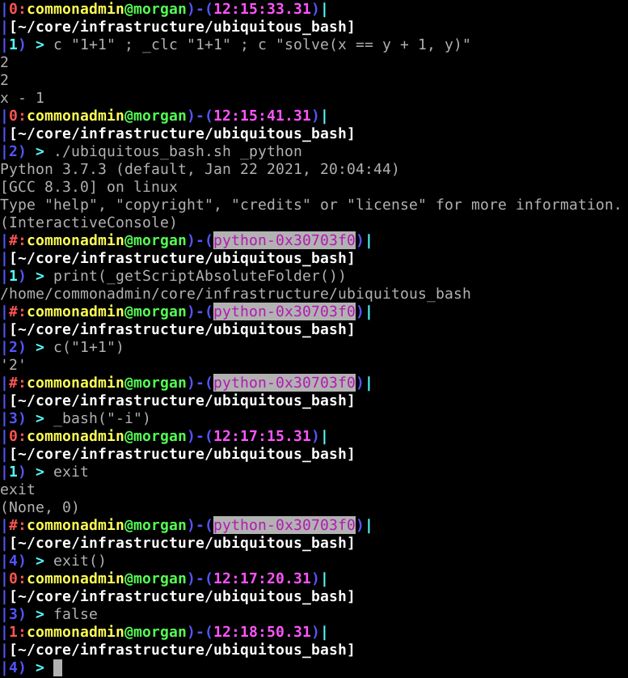

<!-- scriptedIllustrator_markup_uk4uPhB663kVcygT0q 
#exit # scriptedIllustrator_markup_uk4uPhB663kVcygT0q 
# <html style="size: letter;"> <!-- scriptedIllustrator_markup_uk4uPhB663kVcygT0q
#!/usr/bin/env bash

# Dependencies.
# May need 'ubiquitous_bash.sh" in "$PATH".
# GNU Octave, Qalculate - usually dependency of 'calculator' scripts
# recode - usually dependency of 'markup documentation' scripts
# wkhtmltopdf - may be necessary for accurate conversion from HTML to PDF

# NOTICE: README !
# 
# 
# 
# NOTICE: README !

# CAUTION: As a user, you should have been provided a virtual machine or cloud services to run this script - 'ubiquitous bash' provides functions to ease the use of either and both. An SELinux, AppArmor, unprivileged ChRoot, or similar context may be acceptable as well. Routinely modifying, sharing, and running code, may otherwise put both users and organizations at possibly unnecessary risk.

# Copyright and related rights only waived via CC0 if all specified conditions are met.
# *) EITHER, a single file directly output from 'scriptedIllustrator' (which is GPLv3 licensed), OR, not otherwise claimed under other any copyright license.
# *) Is a documentation script including this message which also predominantly creates or represents markup (eg. 'scriptedIllustrator.sh', 'scriptedIllustrator.html', 'scriptedIllustrator.mediawiki.txt').
# *) NOT part of a program to compress, embed, and assemble, functions and other code (waiver does NOT apply to 'tinyCompiler_scriptedIllustrator.sh' ).

# To the extent possible, related software (ie. 'tinyCompiler_scriptedIllustrator.sh' from 'scriptedIllustrator') remains otherwise copyrighted (ie. GPLv3 license).
# Specifically, please do not use 'scriptedIllustrator' code to distribute unpublished proprietary means of creating 'current_internal_CompressedFunctions' .
# Specifically, please do not misconstrue this copyright waiver to negate any copyright claimed when such a documentation script is part of another project or another copyright notice is present (ie. 'otherwise claimed').

# 'For the avoidance of doubt, any information that you choose to store within your own copy' ... 'remains yours' ... 'using' ... 'to publish content doesn't change whatever rights you may have to that content.'
# Although this project has no relation to TiddlyWiki, as stated above, vaguely similar copyright principles are expected to apply. - https://tiddlywiki.com/static/License.html

#__README_uk4uPhB663kVcygT0q_README__

_document_collect() {
# NOTICE: COLLECT

# Not necessary. Warnings about 'command not found' to 'stderr' will be ignored by script pipelines.
#! type -p 'recode' > /dev/null 2>&1 && recode() { false; }

currentByte=8

RECODE_markup_html_pre_begin=$(_safeEcho "$markup_html_pre_begin" | recode ascii..html)

export current_lorem_ipsum='Lorem ipsum dolor sit amet, consectetur adipiscing elit, sed do eiusmod tempor incididunt ut labore et dolore magna aliqua. Ut enim ad minim veniam, quis nostrud exercitation ullamco laboris nisi ut aliquip ex ea commodo consequat. Duis aute irure dolor in reprehenderit in voluptate velit esse cillum dolore eu fugiat nulla pariatur. Excepteur sint occaecat cupidatat non proident, sunt in culpa qui officia deserunt mollit anim id est laborum.'

# NOTICE: COLLECT
}

_document_main() {
#a
#b
# NOTICE: DOCUMENT
#__HEADER_uk4uPhB663kVcygT0q_HEADER__
_t '
scriptedIllustrator_markup_uk4uPhB663kVcygT0q --><!-- # --><pre style="margin-top: 0px;margin-bottom: 0px;white-space: pre-wrap;"> 
<!-- # --></pre><!-- scriptedIllustrator_markup_uk4uPhB663kVcygT0q
'
_t '
scriptedIllustrator_markup_uk4uPhB663kVcygT0q --><!-- # --><pre style="margin-top: 0px;margin-bottom: 0px;white-space: pre-wrap;">
Ubiquitous Bash (public domain, no copyright, CC0)
Multiplatform structured programming middleware.

_ DIRECTORIES _
*) Call script (recursively with new or imported session), files, and other 
programs from same directory as script location.
*) Safe removal of temporary directories. Process termination trapping - 
SIGTERM, SIGINT, etc.

_ MODULAR _
*) Create new software projects by &#39;fork&#39; script.
*) Hierarchical dependency declaration. Inclusion of either all or only 
desired functions and tests.
*) Override at runtime by &#39;_local/ops.sh&#39; and similar files.

_ OPERATING SYSTEM and VIRTUALIZATION _
*) Bootable OS, LiveISO, LiveUSB building and customization simultaneously 
through ChRoot, rsync, BIOS, UEFI, VirtualBox, Qemu, convertible to/from 
Docker.
*) Hibernation and/or persistent filesystems within LiveISO, LiveUSB, as 
native bootable alternative to virtualization provided &#39;save state&#39; 
or &#39;nonpersistence&#39;.

*) Application virtualization (and graphical applications) through several 
fallback backends (&#39;_userChRoot&#39;, &#39;_userVBox&#39;, 
&#39;_userQemu&#39;, &#39;_userDocker&#39;) .
*) Guest program to launch, translated fileparameters, and network 
filesystem mappings indicated by batch and shell scripts from 
&#39;hostToGuestISO&#39; temporary CDROM disc file.

*) Groups of virtual machines portability forced by &#39;_labVBox&#39; 
(notably useful with PFSense to simulate complete WAN network configuration 
at high fidelity).

*) Consistent apparent location of project directory through 
&#39;_abstractfs&#39; (notably used by &#39;arduinoUbiquitous&#39; to make 
firmware builds portable).
*) Home directory portability, and persistence or nonpersistence, forced by 
&#39;_fakeHome&#39; (notably used by &#39;webClient&#39; to force browser 
instances).

*) Legacy OS portability through &#39;_winehere&#39; and &#39;_dosbox&#39; .
*) MSW compatibility integrated by portable &#39;ubcp&#39; &#39;ubiquitous 
bash cygwin portable&#39; and &#39;anchor&#39; &#39;shortcut&#39; batch 
files simultaneously interpretable as bash script (due to interleaved 
&#39;comment&#39; characters).

*) Linux Kernel configuration review, tradeoffs, and recommendations 
(&#39;_kernelConfig_desktop&#39;, &#39;_kernelConfig_mobile&#39;, 
&#39;_kernelConfig_panel&#39;).
*) Hardware support (eg. &#39;Lenovo x220t&#39;, &#39;Huion h1060p&#39;, 
etc) .

_ INTER-PROCESS COMMUNICATION _
*) Multiple-input multiple-output directory pipes, triple buffers, and 
searchable 3D coordinate spaces, interfacing between programs through 
&#39;MetaEngine&#39; .

*) &#39;Broadcast&#39; software bus &#39;queue&#39; more similar to 
hardware bus (eg. &#39;CAN bus&#39;, &#39;UART&#39;, &#39;I2C&#39;, etc) 
emulating &#39;shared pair of wires&#39;.
 *) Pipes automatically recreated through 
&#39;_demand_broadcastPipe_aggregatorStatic&#39;, 
&#39;_aggregator_read&#39;, &#39;_aggregator_write&#39; .
 *) Triple buffers directory through &#39;_demand_broadcastPipe_page&#39;, 
&#39;_page_read&#39;, &#39;_page_write&#39; .
 *) Database IPC through &#39;_db_read&#39;, &#39;_db_write&#39; (may track 
Virtual Machine or other simulated hardware UART serial ports to connect 
through software IPC).
 *) Network adapters through 
&#39;_aggregatorStatic_socket_unix_server&#39;, 
&#39;_aggregatorStatic_socket_unix_client&#39;, 
&#39;_aggregatorStatic_socket_tcp_server&#39;, 
&#39;_aggregatorStatic_socket_tcp_client&#39;, 
&#39;_page_socket_tcp_server&#39;, &#39;_page_socket_tcp_client&#39;, 
&#39;_page_socket_unix_server&#39;, &#39;_page_socket_unix_client&#39; .

_ DEV _
*) Situational awareness command-line Bash and Python prompts after 
&#39;_setupUbiquitous&#39; .
*) Equation solver (&#39;c&#39;, &#39;_clc&#39;) added to Bash and Python 
prompts after &#39;_setupUbiquitous&#39; (&#39;Qalculate&#39; and &#39;GNU 
Octave&#39; backends).
*) Python to Bash and Bash to Python bindings with Ubiquitous Bash 
functions (eg. &#39; print(_getScriptAbsoluteFolder()) &#39; )
*) Build dependencies, compiling, and calling other build systems (eg. 
cmake).

_ REMOTE _
*) NAT public services and inbound SSH fallbacks. AutoSSH robust 
configuration, automatic restart, tested over multiple years.
*) SSH automatic multi-path and multi-hop.
*) VNC to existing (ie. &#39;_detect_x11&#39;) and new (ie. 
&#39;x11vnc&#39;) display sessions, through SSH commands without installed 
service.

*) Cloud - &#39;rclone&#39;, &#39;aws&#39;, &#39;gcloud&#39;, 
&#39;digitalocean&#39;, &#39;linode&#39;, etc (notably cloud services may 
efficiently build, test, and distribute software).

Much more functionality exists than listed here. At approximately ~1500 
function declarations, ~20000 lines of shell script code, ~1MB (~1 million 
characters), years of intense development, and years of thorough testing, 
Ubiquitous Bash exists to resolve many very significant and substantial 
software issues.
<!-- # --></pre><!-- scriptedIllustrator_markup_uk4uPhB663kVcygT0q
'
_t '
scriptedIllustrator_markup_uk4uPhB663kVcygT0q --><!-- # --><pre style="margin-top: 0px;margin-bottom: 0px;white-space: pre-wrap;">

<!-- # --></pre><!-- scriptedIllustrator_markup_uk4uPhB663kVcygT0q
'
 '_page'
if false; then true; # -->
<!-- # -->
 

<!--
fi
 '_heading1' 'Demonstrations'
if false; then true; # -->
<!-- # --><h1>Demonstrations</h1>
<!--
fi
 '_heading2' 'Situational Awareness Command-Line Bash and Python Prompts'
if false; then true; # -->
<!-- # --><h2>Situational Awareness Command-Line Bash and Python Prompts</h2>
<!--
fi
_t '
scriptedIllustrator_markup_uk4uPhB663kVcygT0q --><!-- # --><pre style="margin-top: 0px;margin-bottom: 0px;white-space: pre-wrap;">
(pictured right)
<!-- # --></pre><!-- scriptedIllustrator_markup_uk4uPhB663kVcygT0q
'
 '_picture' 'zImage_commandPrompt.png' '485px'
if false; then true; # -->
<!-- # -->
<!--
fi
 '_' '_picture' 'zImage_commandPrompt.png' '45%'
 '_' '_paragraph_begin' '['
 '_heading2' 'Linux Application Virtualization'
if false; then true; # -->
<!-- # --><h2>Linux Application Virtualization</h2>
<!--
fi
 '_cells_begin'
if false; then true; # -->
<!-- # --><table width="0%" style="empty-cells: show; border-spacing: 0px; border: 1px solid black; margin-top: 0px; vertical-align: top;">
<!--
fi
 '_cells_row_begin'
if false; then true; # -->
<!-- # --><tr>
<!--
fi
 '_cells_speck_begin' '460px'
if false; then true; # -->
<!-- # --><td width="460px" colspan="1" style="border-spacing: 0px; border: 1px solid black; margin-top: 0px; vertical-align: top;">
<!--
fi
 '_o' '_messagePlain_probe' './ubiquitous_bash.sh _userQemu leafpad ./CC0_license.txt'
if false; then true; # -->
<!-- # --><pre style="-webkit-print-color-adjust: exact;background-color:#848484;margin-top: 0px;margin-bottom: 0px;white-space: pre-wrap;">
<!-- # --> ./ubiquitous_bash.sh _userQemu leafpad ./CC0_license.txt
<!-- # --></pre>
<!--
fi
 '_cells_speck_end'
if false; then true; # -->
<!-- # --></td>
<!--
fi
 '_cells_row_end'
if false; then true; # -->
<!-- # --></tr>
<!--
fi
 '_cells_end'
if false; then true; # -->
<!-- # --></table>
<!--
fi
 '_' '_image' 'zImage_userQemu_command_nix.png' '450px'
 '_' '_image' 'zImage_userQemu_command_nix.png' '45%'
 '_' '_t' ' '
 '_' '_image' 'zImage_userQemu_window_nix.png' '450px'
 '_' '_image' 'zImage_userQemu_window_nix.png' '45%'
 '_image' 'zImage_userQemu_window_nix.png' '275px'
if false; then true; # -->
<!-- # -->
<!--
fi
 '_' '_paragraph_end' ']'
 '_' '_paragraph_begin' '['
 '_heading2' 'MSW Application Virtualization'
if false; then true; # -->
<!-- # --><h2>MSW Application Virtualization</h2>
<!--
fi
 '_' '_picture' 'zImage_queue_experiment.jpg' '485px'
 '_cells_begin'
if false; then true; # -->
<!-- # --><table width="0%" style="empty-cells: show; border-spacing: 0px; border: 1px solid black; margin-top: 0px; vertical-align: top;">
<!--
fi
 '_cells_row_begin'
if false; then true; # -->
<!-- # --><tr>
<!--
fi
 '_cells_speck_begin' '485px'
if false; then true; # -->
<!-- # --><td width="485px" colspan="1" style="border-spacing: 0px; border: 1px solid black; margin-top: 0px; vertical-align: top;">
<!--
fi
 '_o' '_messagePlain_probe' './ubiquitous_bash.sh _userVBox notepad.exe ./CC0_license.txt'
if false; then true; # -->
<!-- # --><pre style="-webkit-print-color-adjust: exact;background-color:#848484;margin-top: 0px;margin-bottom: 0px;white-space: pre-wrap;">
<!-- # --> ./ubiquitous_bash.sh _userVBox notepad.exe ./CC0_license.txt
<!-- # --></pre>
<!--
fi
 '_cells_speck_end'
if false; then true; # -->
<!-- # --></td>
<!--
fi
 '_cells_row_end'
if false; then true; # -->
<!-- # --></tr>
<!--
fi
 '_cells_end'
if false; then true; # -->
<!-- # --></table>
<!--
fi
 '_' '_image' 'zImage_userVBox_command_MSW.png' '450px'
 '_' '_t' ' '
 '_' '_image' 'zImage_userVBox_window_MSW.png' '450px'
 '_image' 'zImage_userVBox_window_MSW.png' '275px'
if false; then true; # -->
<!-- # -->
<!--
fi
 '_' '_paragraph_end' ']'
 '_' '_paragraph_begin' '['
 '_heading2' 'Queue Inter-Process Communication'
if false; then true; # -->
<!-- # --><h2>Queue Inter-Process Communication</h2>
<!--
fi
 '_picture' 'zImage_queue_experiment.jpg' '485px'
if false; then true; # -->
<!-- # -->
<!--
fi
 '_' '_t' '(pictured right, above)'
_t '
scriptedIllustrator_markup_uk4uPhB663kVcygT0q --><!-- # --><pre style="margin-top: 0px;margin-bottom: 0px;white-space: pre-wrap;">
(pictured right)
<!-- # --></pre><!-- scriptedIllustrator_markup_uk4uPhB663kVcygT0q
'
 '_' '_paragraph_end' ']'
 '_'
 '_'
 '_' '_page'
 '_' '_paragraph_begin' '['
 '_' '_heading2' 'Queue Inter-Process Communication'
 '_' '_image' 'zImage_queue_experiment_rotated.jpg' '65%'
 '_' '_paragraph_end' ']'
 '_heading2' '_test-shell'
if false; then true; # -->
<!-- # --><h2>_test-shell</h2>
<!--
fi
 '_cells_begin'
if false; then true; # -->
<!-- # --><table width="0%" style="empty-cells: show; border-spacing: 0px; border: 1px solid black; margin-top: 0px; vertical-align: top;">
<!--
fi
 '_cells_row_begin'
if false; then true; # -->
<!-- # --><tr>
<!--
fi
 '_cells_speck_begin' '460px'
if false; then true; # -->
<!-- # --><td width="460px" colspan="1" style="border-spacing: 0px; border: 1px solid black; margin-top: 0px; vertical-align: top;">
<!--
fi
 '_i' 'cd' '"$scriptAbsoluteFolder"'
if false; then true; # -->
<!--
fi
 '_e_' './ubiquitous_bash.sh' '_test-shell' '2>/dev/null'
if false; then true; # -->
<!-- # --><pre style="-webkit-print-color-adjust: exact;background-color:#848484;margin-top: 0px;margin-bottom: 0px;white-space: pre-wrap;">
<!-- # -->  './ubiquitous_bash.sh' '_test-shell' '2>/dev/null'
<!-- # -->#  Sanity...
<!-- # -->#  PASS
<!-- # -->#  Permissions...
<!-- # -->#  PASS
<!-- # -->#  Argument length...
<!-- # -->#  PASS
<!-- # -->#  Absolute pathfinding...
<!-- # -->#  PASS
<!-- # --></pre>
<!--
fi
 '_cells_speck_end'
if false; then true; # -->
<!-- # --></td>
<!--
fi
 '_cells_row_end'
if false; then true; # -->
<!-- # --></tr>
<!--
fi
 '_cells_end'
if false; then true; # -->
<!-- # --></table>
<!--
fi
 '_' '_page'
 '_heading2' 'VM - Create and Multiplatform'
if false; then true; # -->
<!-- # --><h2>VM - Create and Multiplatform</h2>
<!--
fi
_t '
scriptedIllustrator_markup_uk4uPhB663kVcygT0q --><!-- # --><pre style="margin-top: 0px;margin-bottom: 0px;white-space: pre-wrap;">
Virtualization commands (at least &#39;_userVBox&#39;, &#39;_editVBox) may 
be usable from both GNU/Linux and Cygwin/MSW hosts. Cygwin/MSW hosts should 
be sufficient for end-user applications under narrow conditions, though 
such functionality may be more robust and complete from GNU/Linux hosts. 
Developers using MSW (ie. for VR software reasons) are strongly encouraged 
to use GNU/Linux guest with nested virtualization as a GNU/Linux host and 
workstation. At least VMWare Workstation installed at a MSW host can 
provide nested virtualization compatible with a guest installation of 
VirtualBox.
<!-- # --></pre><!-- scriptedIllustrator_markup_uk4uPhB663kVcygT0q
'
 '_o' '_messagePlain_probe' 'export vmSize=24576'
if false; then true; # -->
<!-- # --><pre style="-webkit-print-color-adjust: exact;background-color:#848484;margin-top: 0px;margin-bottom: 0px;white-space: pre-wrap;">
<!-- # --> export vmSize=24576
<!-- # --></pre>
<!--
fi
 '_o' '_messagePlain_probe' './_bin.bat ./ubiquitous_bash.sh _createRawImage'
if false; then true; # -->
<!-- # --><pre style="-webkit-print-color-adjust: exact;background-color:#848484;margin-top: 0px;margin-bottom: 0px;white-space: pre-wrap;">
<!-- # --> ./_bin.bat ./ubiquitous_bash.sh _createRawImage
<!-- # --></pre>
<!--
fi
 '_o' '_messagePlain_probe' './_bin.bat ./ubiquitous_bash.sh _img_to_vdi'
if false; then true; # -->
<!-- # --><pre style="-webkit-print-color-adjust: exact;background-color:#848484;margin-top: 0px;margin-bottom: 0px;white-space: pre-wrap;">
<!-- # --> ./_bin.bat ./ubiquitous_bash.sh _img_to_vdi
<!-- # --></pre>
<!--
fi
 '_o' '_messagePlain_probe' './_bin.bat ./ubiquitous_bash.sh _userVBox'
if false; then true; # -->
<!-- # --><pre style="-webkit-print-color-adjust: exact;background-color:#848484;margin-top: 0px;margin-bottom: 0px;white-space: pre-wrap;">
<!-- # --> ./_bin.bat ./ubiquitous_bash.sh _userVBox
<!-- # --></pre>
<!--
fi
 '_' '_t' '

'
 '_page'
if false; then true; # -->
<!-- # -->
 

<!--
fi
 '_heading1' 'Examples'
if false; then true; # -->
<!-- # --><h1>Examples</h1>
<!--
fi
 '_heading2' 'DIRECTORIES, MODULAR'
if false; then true; # -->
<!-- # --><h2>DIRECTORIES, MODULAR</h2>
<!--
fi
 '_heading3' 'BOM_designer'
if false; then true; # -->
<!-- # --><h3>BOM_designer</h3>
<!--
fi
_t '
scriptedIllustrator_markup_uk4uPhB663kVcygT0q --><!-- # --><pre style="margin-top: 0px;margin-bottom: 0px;white-space: pre-wrap;">
Hierarchical text-based Bill-of-Materials. Finds all all files with 
extensions &#39;.lbom.csv&#39;, &#39;.lbom.txt&#39;, &#39;*.lbom&#39; . 
Compiles a consolidated list.
<!-- # --></pre><!-- scriptedIllustrator_markup_uk4uPhB663kVcygT0q
'
 '_heading3' 'gEDA_designer'
if false; then true; # -->
<!-- # --><h3>gEDA_designer</h3>
<!--
fi
_t '
scriptedIllustrator_markup_uk4uPhB663kVcygT0q --><!-- # --><pre style="margin-top: 0px;margin-bottom: 0px;white-space: pre-wrap;">
Designer. Extensively automates integration and manufacturing specification 
files (eg. PDF, CAD model, &#39;gerber&#39;, PCB photolithography masks, 
etc).
<!-- # --></pre><!-- scriptedIllustrator_markup_uk4uPhB663kVcygT0q
'
 '_heading3' 'scriptedIllustrator'
if false; then true; # -->
<!-- # --><h3>scriptedIllustrator</h3>
<!--
fi
_t '
scriptedIllustrator_markup_uk4uPhB663kVcygT0q --><!-- # --><pre style="margin-top: 0px;margin-bottom: 0px;white-space: pre-wrap;">
From shell script to interleaved self-modifying shell script and markup of 
&#39;html&#39;, &#39;pdf&#39;, &#39;mediawiki&#39;, &#39;markdown&#39;, etc.
https://github.com/mirage335/scriptedIllustrator
<!-- # --></pre><!-- scriptedIllustrator_markup_uk4uPhB663kVcygT0q
'
 '_' '_heading3' 'extendedInterface'
 '_' '_t' 'Physical and Virtual Reality specification (eg. &#39;commonControlScheme&#39;, &#39;referenceImplementations&#39; keybinds). Containment (eg. &#39;JoystickGremlin&#39;, &#39;VoiceAttack&#39;) and interface standardization for relevant MSW applications, likely to increasingly rely on "Ubiquitous Bash" functions.'
 '_heading2' 'OPERATING SYSTEM and VIRTUALIZATION'
if false; then true; # -->
<!-- # --><h2>OPERATING SYSTEM and VIRTUALIZATION</h2>
<!--
fi
 '_heading3' 'arduinoUbiquitous'
if false; then true; # -->
<!-- # --><h3>arduinoUbiquitous</h3>
<!--
fi
_t '
scriptedIllustrator_markup_uk4uPhB663kVcygT0q --><!-- # --><pre style="margin-top: 0px;margin-bottom: 0px;white-space: pre-wrap;">
Both &#39;_abstractfs&#39; and &#39;_fakeHome&#39; contain 
&#39;Arduino&#39;, related programs, and libraries, to create firmware 
projects with portability comparable to "makefile" or "cmake" projects. 
External debug tool interfaces (eg. &#39;gdb&#39;, &#39;ddd&#39;) are also 
integrated.
https://github.com/mirage335/arduinoUbiquitous
<!-- # --></pre><!-- scriptedIllustrator_markup_uk4uPhB663kVcygT0q
'
 '_heading3' 'webClient'
if false; then true; # -->
<!-- # --><h3>webClient</h3>
<!--
fi
_t '
scriptedIllustrator_markup_uk4uPhB663kVcygT0q --><!-- # --><pre style="margin-top: 0px;margin-bottom: 0px;white-space: pre-wrap;">
Forces browser profile portability and multi-instance through 
&#39;_fakeHome&#39;.
https://github.com/mirage335/webClient
<!-- # --></pre><!-- scriptedIllustrator_markup_uk4uPhB663kVcygT0q
'
 '_heading3' 'freecad-assembly2'
if false; then true; # -->
<!-- # --><h3>freecad-assembly2</h3>
<!--
fi
_t '
scriptedIllustrator_markup_uk4uPhB663kVcygT0q --><!-- # --><pre style="margin-top: 0px;margin-bottom: 0px;white-space: pre-wrap;">
FreeCAD assembly2 and a2plus module portability through &#39;_fakeHome&#39;.
https://github.com/mirage335/freecad-assembly2
<!-- # --></pre><!-- scriptedIllustrator_markup_uk4uPhB663kVcygT0q
'
 '_heading3' 'kit-raspi'
if false; then true; # -->
<!-- # --><h3>kit-raspi</h3>
<!--
fi
_t '
scriptedIllustrator_markup_uk4uPhB663kVcygT0q --><!-- # --><pre style="margin-top: 0px;margin-bottom: 0px;white-space: pre-wrap;">
RasPi and x64 bootable OS, LiveISO, LiveUSB building and customization 
mostly through &#39;_chroot&#39;, &#39;cp -a&#39;, &#39;rsync&#39; .
https://github.com/mirage335/ubiquitous_bash/tree/master/_lib/kit/raspi
<!-- # --></pre><!-- scriptedIllustrator_markup_uk4uPhB663kVcygT0q
'
 '_heading2' 'INTER-PROCESS COMMUNICATION'
if false; then true; # -->
<!-- # --><h2>INTER-PROCESS COMMUNICATION</h2>
<!--
fi
 '_heading3' 'metaBus'
if false; then true; # -->
<!-- # --><h3>metaBus</h3>
<!--
fi
_t '
scriptedIllustrator_markup_uk4uPhB663kVcygT0q --><!-- # --><pre style="margin-top: 0px;margin-bottom: 0px;white-space: pre-wrap;">
Reference implementation illustrating connecting multiple programs through 
&#39;MetaEngine&#39; .
https://github.com/mirage335/metaBus
<!-- # --></pre><!-- scriptedIllustrator_markup_uk4uPhB663kVcygT0q
'
 '_heading2' 'DEV'
if false; then true; # -->
<!-- # --><h2>DEV</h2>
<!--
fi
 '_heading3' 'pcb-ioAutorouter'
if false; then true; # -->
<!-- # --><h3>pcb-ioAutorouter</h3>
<!--
fi
_t '
scriptedIllustrator_markup_uk4uPhB663kVcygT0q --><!-- # --><pre style="margin-top: 0px;margin-bottom: 0px;white-space: pre-wrap;">
Compiles and contains installation of &#39;pcb&#39; with patch for 
&#39;autorouter&#39; compatibility.
<!-- # --></pre><!-- scriptedIllustrator_markup_uk4uPhB663kVcygT0q
'
 '_heading2' 'REMOTE'
if false; then true; # -->
<!-- # --><h2>REMOTE</h2>
<!--
fi
 '_heading3' 'CoreAutoSSH'
if false; then true; # -->
<!-- # --><h3>CoreAutoSSH</h3>
<!--
fi
_t '
scriptedIllustrator_markup_uk4uPhB663kVcygT0q --><!-- # --><pre style="margin-top: 0px;margin-bottom: 0px;white-space: pre-wrap;">
Remote logical network configuration . Automatic SSH multi-path and 
multi-hop.
https://github.com/mirage335/CoreAutoSSH
<!-- # --></pre><!-- scriptedIllustrator_markup_uk4uPhB663kVcygT0q
'
_t '
scriptedIllustrator_markup_uk4uPhB663kVcygT0q --><!-- # --><pre style="margin-top: 0px;margin-bottom: 0px;white-space: pre-wrap;">

<!-- # --></pre><!-- scriptedIllustrator_markup_uk4uPhB663kVcygT0q
'
 '_page'
if false; then true; # -->
<!-- # -->
 

<!--
fi
 '_heading1' 'Usage'
if false; then true; # -->
<!-- # --><h1>Usage</h1>
<!--
fi
 '_paragraph_begin'
if false; then true; # -->
<!-- # -->

<!--
fi
 '_o' '_messagePlain_probe_noindent' './ubiquitous_bash.sh
./ubiquitous_bash.sh _test
./ubiquitous_bash.sh _setup'
if false; then true; # -->
<!-- # --><pre style="-webkit-print-color-adjust: exact;background-color:#848484;margin-top: 0px;margin-bottom: 0px;white-space: pre-wrap;">
<!-- # -->./ubiquitous_bash.sh
<!-- # -->./ubiquitous_bash.sh _test
<!-- # -->./ubiquitous_bash.sh _setup
<!-- # --></pre>
<!--
fi
 '_paragraph_end'
if false; then true; # -->
<!-- # -->

<!--
fi
 '_paragraph_begin'
if false; then true; # -->
<!-- # -->

<!--
fi
_t '
scriptedIllustrator_markup_uk4uPhB663kVcygT0q --><!-- # --><pre style="margin-top: 0px;margin-bottom: 0px;white-space: pre-wrap;">
Projects using Ubiquitous Bash as a git submodule can be created by 
&#39;fork&#39; script. Examples of common modifications to such projects 
are available at &#39;_lib/kit&#39; directory. Project name, and developer 
name, must be set by editing &#39;fork&#39; script appropriately.
<!-- # --></pre><!-- scriptedIllustrator_markup_uk4uPhB663kVcygT0q
'
 '_o' '_messagePlain_probe_noindent' '# Move &#39;fork&#39; to a different directory and edit appropriately.
./fork'
if false; then true; # -->
<!-- # --><pre style="-webkit-print-color-adjust: exact;background-color:#848484;margin-top: 0px;margin-bottom: 0px;white-space: pre-wrap;">
<!-- # --># Move &#39;fork&#39; to a different directory and edit appropriately.
<!-- # -->./fork
<!-- # --></pre>
<!--
fi
 '_paragraph_end'
if false; then true; # -->
<!-- # -->

<!--
fi
 '_heading2' 'Python'
if false; then true; # -->
<!-- # --><h2>Python</h2>
<!--
fi
 '_paragraph_begin'
if false; then true; # -->
<!-- # -->

<!--
fi
 '_o' '_messagePlain_probe_noindent' './ubiquitous_bash.sh _python

print(_getScriptAbsoluteFolder())
_bin("_getAbsoluteFolder .")
_bin("_getAbsoluteLocation .")

_clc(&#39;1 + 2&#39;)
_qalculate(&#39;1 + 2&#39;)
_octave(&#39;1 + 2&#39;)
print(_octave_solve(&#39;(y == x * 2, x)&#39; ))

_bash( &#39;-i&#39; )
_python
exit()
exit
exit()'
if false; then true; # -->
<!-- # --><pre style="-webkit-print-color-adjust: exact;background-color:#848484;margin-top: 0px;margin-bottom: 0px;white-space: pre-wrap;">
<!-- # -->./ubiquitous_bash.sh _python
<!-- # -->
<!-- # -->print(_getScriptAbsoluteFolder())
<!-- # -->_bin("_getAbsoluteFolder .")
<!-- # -->_bin("_getAbsoluteLocation .")
<!-- # -->
<!-- # -->_clc(&#39;1 + 2&#39;)
<!-- # -->_qalculate(&#39;1 + 2&#39;)
<!-- # -->_octave(&#39;1 + 2&#39;)
<!-- # -->print(_octave_solve(&#39;(y == x * 2, x)&#39; ))
<!-- # -->
<!-- # -->_bash( &#39;-i&#39; )
<!-- # -->_python
<!-- # -->exit()
<!-- # -->exit
<!-- # -->exit()
<!-- # --></pre>
<!--
fi
 '_paragraph_end'
if false; then true; # -->
<!-- # -->

<!--
fi
 '_heading2' 'NixOS (nix-shell)'
if false; then true; # -->
<!-- # --><h2>NixOS (nix-shell)</h2>
<!--
fi
 '_paragraph_begin'
if false; then true; # -->
<!-- # -->

<!--
fi
 '_o' '_messagePlain_probe_noindent' 'ns'
if false; then true; # -->
<!-- # --><pre style="-webkit-print-color-adjust: exact;background-color:#848484;margin-top: 0px;margin-bottom: 0px;white-space: pre-wrap;">
<!-- # -->ns
<!-- # --></pre>
<!--
fi
_t '
scriptedIllustrator_markup_uk4uPhB663kVcygT0q --><!-- # --><pre style="margin-top: 0px;margin-bottom: 0px;white-space: pre-wrap;">
Automatic installation through _test , _getMinimal , etc, for GNU/Linux, 
etc. Shortcut functions for &#39;nix-shell&#39; , etc .
<!-- # --></pre><!-- scriptedIllustrator_markup_uk4uPhB663kVcygT0q
'
 '_paragraph_end'
if false; then true; # -->
<!-- # -->

<!--
fi
 '_heading2' 'rclone, croc, sshf, vncf'
if false; then true; # -->
<!-- # --><h2>rclone, croc, sshf, vncf</h2>
<!--
fi
 '_paragraph_begin'
if false; then true; # -->
<!-- # -->

<!--
fi
 '_o' '_messagePlain_probe_noindent' 'rclone'
if false; then true; # -->
<!-- # --><pre style="-webkit-print-color-adjust: exact;background-color:#848484;margin-top: 0px;margin-bottom: 0px;white-space: pre-wrap;">
<!-- # -->rclone
<!-- # --></pre>
<!--
fi
 '_o' '_messagePlain_probe_noindent' 'croc'
if false; then true; # -->
<!-- # --><pre style="-webkit-print-color-adjust: exact;background-color:#848484;margin-top: 0px;margin-bottom: 0px;white-space: pre-wrap;">
<!-- # -->croc
<!-- # --></pre>
<!--
fi
_t '
scriptedIllustrator_markup_uk4uPhB663kVcygT0q --><!-- # --><pre style="margin-top: 0px;margin-bottom: 0px;white-space: pre-wrap;">
Automatic installation through _test , _getMinimal , etc, for GNU/Linux, 
etc. Normally usable through Cygwin/MSW if in path (ie. if installed by 
&#39;chocolatey&#39;).

<!-- # --></pre><!-- scriptedIllustrator_markup_uk4uPhB663kVcygT0q
'
 '_o' '_messagePlain_probe_noindent' 'sshf user@IPaddr'
if false; then true; # -->
<!-- # --><pre style="-webkit-print-color-adjust: exact;background-color:#848484;margin-top: 0px;margin-bottom: 0px;white-space: pre-wrap;">
<!-- # -->sshf user@IPaddr
<!-- # --></pre>
<!--
fi
 '_o' '_messagePlain_probe_noindent' 'vncf IPaddr'
if false; then true; # -->
<!-- # --><pre style="-webkit-print-color-adjust: exact;background-color:#848484;margin-top: 0px;margin-bottom: 0px;white-space: pre-wrap;">
<!-- # -->vncf IPaddr
<!-- # --></pre>
<!--
fi
_t '
scriptedIllustrator_markup_uk4uPhB663kVcygT0q --><!-- # --><pre style="margin-top: 0px;margin-bottom: 0px;white-space: pre-wrap;">
Force remote access - vncf in particular will attempt root (ie. display 
manager GUI) by default, or user session. Especially compatible with 
&#39;rotten_install&#39; cloud init scripts, and can connect to cloud 
Server/VPS by reused IP address and SSH public key. Cygwin/MSW users must 
install native vncviewer from &#39;TigerVNC&#39; installer package .
<!-- # --></pre><!-- scriptedIllustrator_markup_uk4uPhB663kVcygT0q
'
 '_paragraph_end'
if false; then true; # -->
<!-- # -->

<!--
fi
 '_paragraph_begin'
if false; then true; # -->
<!-- # -->

<!--
fi
_t '
scriptedIllustrator_markup_uk4uPhB663kVcygT0q --><!-- # --><pre style="margin-top: 0px;margin-bottom: 0px;white-space: pre-wrap;">

<!-- # --></pre><!-- scriptedIllustrator_markup_uk4uPhB663kVcygT0q
'
 '_heading2' 'Support'
if false; then true; # -->
<!-- # --><h2>Support</h2>
<!--
fi
 '_paragraph_begin'
if false; then true; # -->
<!-- # -->

<!--
fi
_t '
scriptedIllustrator_markup_uk4uPhB663kVcygT0q --><!-- # --><pre style="margin-top: 0px;margin-bottom: 0px;white-space: pre-wrap;">Ubiquitous Bash is supported on an *urgent basis*, nominally *immediate*, 
due to long established dependability and uses. Any support request will be 
attended to ASAP. Please do not hesitate to contact maintainer "mirage335" 
by any means.

Bug reports, feature requests, forks, and especially pull requests, are 
highly welcome. Please keep in mind "defense in depth" and explicit tests 
are preferred measures to ensure against regressions. Ubiquitous Bash 
GitHub repository is monitored frequently if not in real time.
<!-- # --></pre><!-- scriptedIllustrator_markup_uk4uPhB663kVcygT0q
'
 '_paragraph_end'
if false; then true; # -->
<!-- # -->

<!--
fi
_t '
scriptedIllustrator_markup_uk4uPhB663kVcygT0q --><!-- # --><pre style="margin-top: 0px;margin-bottom: 0px;white-space: pre-wrap;">

<!-- # --></pre><!-- scriptedIllustrator_markup_uk4uPhB663kVcygT0q
'
 '_page'
if false; then true; # -->
<!-- # -->
 

<!--
fi
 '_heading1' 'Design'
if false; then true; # -->
<!-- # --><h1>Design</h1>
<!--
fi
 '_paragraph_begin'
if false; then true; # -->
<!-- # -->

<!--
fi
_t '
scriptedIllustrator_markup_uk4uPhB663kVcygT0q --><!-- # --><pre style="margin-top: 0px;margin-bottom: 0px;white-space: pre-wrap;">
Entry points for developers are described here. To understand Ubiquitous 
Bash, often it will be necessary to search for these bits of shell code in 
&#39;ubiquitous_bash.sh&#39; or other related files.
<!-- # --></pre><!-- scriptedIllustrator_markup_uk4uPhB663kVcygT0q
'
 '_o' '_messagePlain_probe_noindent' '_findFunction() {
	find . -not -path "./_local/*" -name &#39;*.sh&#39; -type f -size -3000k -exec grep -n "$@" &#39;{}&#39; /dev/null \;
}'
if false; then true; # -->
<!-- # --><pre style="-webkit-print-color-adjust: exact;background-color:#848484;margin-top: 0px;margin-bottom: 0px;white-space: pre-wrap;">
<!-- # -->_findFunction() {
<!-- # -->	find . -not -path "./_local/*" -name &#39;*.sh&#39; -type f -size -3000k -exec grep -n "$@" &#39;{}&#39; /dev/null \;
<!-- # -->}
<!-- # --></pre>
<!--
fi
 '_paragraph_end'
if false; then true; # -->
<!-- # -->

<!--
fi
 '_heading2' 'DIRECTORIES'
if false; then true; # -->
<!-- # --><h2>DIRECTORIES</h2>
<!--
fi
 '_paragraph_begin'
if false; then true; # -->
<!-- # -->

<!--
fi
_t '
scriptedIllustrator_markup_uk4uPhB663kVcygT0q --><!-- # --><pre style="margin-top: 0px;margin-bottom: 0px;white-space: pre-wrap;">
Script absolute &#39;location&#39;, script absolute &#39;folder&#39;, 
unique "sessionid", will be set, and temporary directories created, as 
specified by structure/globalvars.sh .
<!-- # --></pre><!-- scriptedIllustrator_markup_uk4uPhB663kVcygT0q
'
 '_o' '_messagePlain_probe_noindent' 'export sessionid=$(_uid)
export scriptAbsoluteLocation=$(_getScriptAbsoluteLocation)
export scriptAbsoluteFolder=$(_getScriptAbsoluteFolder)
[[ "$tmpSelf" == "" ]] && export tmpSelf="$scriptAbsoluteFolder"
export safeTmp="$tmpSelf""$tmpPrefix"/w_"$sessionid"'
if false; then true; # -->
<!-- # --><pre style="-webkit-print-color-adjust: exact;background-color:#848484;margin-top: 0px;margin-bottom: 0px;white-space: pre-wrap;">
<!-- # -->export sessionid=$(_uid)
<!-- # -->export scriptAbsoluteLocation=$(_getScriptAbsoluteLocation)
<!-- # -->export scriptAbsoluteFolder=$(_getScriptAbsoluteFolder)
<!-- # -->[[ "$tmpSelf" == "" ]] && export tmpSelf="$scriptAbsoluteFolder"
<!-- # -->export safeTmp="$tmpSelf""$tmpPrefix"/w_"$sessionid"
<!-- # --></pre>
<!--
fi
 '_paragraph_end'
if false; then true; # -->
<!-- # -->

<!--
fi
 '_paragraph_begin'
if false; then true; # -->
<!-- # -->

<!--
fi
_t '
scriptedIllustrator_markup_uk4uPhB663kVcygT0q --><!-- # --><pre style="margin-top: 0px;margin-bottom: 0px;white-space: pre-wrap;">
New "sessionid" is commonly obtained to separate temporary directories. 
Temporary directories are created by &#39;_start&#39;, removed by 
&#39;_stop&#39;. Process termination signal (eg. SIGTERM, SIGINT) calls 
&#39;_stop&#39;.
<!-- # --></pre><!-- scriptedIllustrator_markup_uk4uPhB663kVcygT0q
'
 '_o' '_messagePlain_probe_noindent' '_userFakeHome_procedure() {
	export actualFakeHome="$instancedFakeHome"
	export fakeHomeEditLib="false"
	_fakeHome "$@"
}

_userFakeHome_sequence() {
	_start
	
	_userFakeHome_procedure "$@"
	
	_stop $?
}

_userFakeHome() {
	"$scriptAbsoluteLocation" _userFakeHome_sequence "$@"
}

"$scriptAbsoluteLocation" _userFakeHome /bin/true || _stop 1'
if false; then true; # -->
<!-- # --><pre style="-webkit-print-color-adjust: exact;background-color:#848484;margin-top: 0px;margin-bottom: 0px;white-space: pre-wrap;">
<!-- # -->_userFakeHome_procedure() {
<!-- # -->	export actualFakeHome="$instancedFakeHome"
<!-- # -->	export fakeHomeEditLib="false"
<!-- # -->	_fakeHome "$@"
<!-- # -->}
<!-- # -->
<!-- # -->_userFakeHome_sequence() {
<!-- # -->	_start
<!-- # -->	
<!-- # -->	_userFakeHome_procedure "$@"
<!-- # -->	
<!-- # -->	_stop $?
<!-- # -->}
<!-- # -->
<!-- # -->_userFakeHome() {
<!-- # -->	"$scriptAbsoluteLocation" _userFakeHome_sequence "$@"
<!-- # -->}
<!-- # -->
<!-- # -->"$scriptAbsoluteLocation" _userFakeHome /bin/true || _stop 1
<!-- # --></pre>
<!--
fi
 '_paragraph_end'
if false; then true; # -->
<!-- # -->

<!--
fi
 '_heading2' 'MODULAR'
if false; then true; # -->
<!-- # --><h2>MODULAR</h2>
<!--
fi
 '_paragraph_begin'
if false; then true; # -->
<!-- # -->

<!--
fi
_t '
scriptedIllustrator_markup_uk4uPhB663kVcygT0q --><!-- # --><pre style="margin-top: 0px;margin-bottom: 0px;white-space: pre-wrap;">
After &#39;fork&#39; script has created a new project, new code may be 
added to the usual files in the &#39;_prog&#39; directory among other 
places. These and other desired shell script fragments are 
&#39;compiled&#39; .
Typical program entry point is usually &#39;_main()&#39; defined through 
&#39;_prog/program.sh&#39; file.
<!-- # --></pre><!-- scriptedIllustrator_markup_uk4uPhB663kVcygT0q
'
 '_o' '_messagePlain_probe_noindent' './compile.sh'
if false; then true; # -->
<!-- # --><pre style="-webkit-print-color-adjust: exact;background-color:#848484;margin-top: 0px;margin-bottom: 0px;white-space: pre-wrap;">
<!-- # -->./compile.sh
<!-- # --></pre>
<!--
fi
 '_paragraph_end'
if false; then true; # -->
<!-- # -->

<!--
fi
 '_paragraph_begin'
if false; then true; # -->
<!-- # -->

<!--
fi
_t '
scriptedIllustrator_markup_uk4uPhB663kVcygT0q --><!-- # --><pre style="margin-top: 0px;margin-bottom: 0px;white-space: pre-wrap;">
Another possibility is to edit &#39;lean.sh&#39; directly. Such is strictly 
monolithic and inconvenient to upgrade, not recommended for most software 
projects which tend to become quite large rather quickly.
<!-- # --></pre><!-- scriptedIllustrator_markup_uk4uPhB663kVcygT0q
'
 '_o' '_messagePlain_probe_noindent' 'export ub_setScriptChecksum_disable=&#39;true&#39;
#...
#####Entry
#...
_main "$@"'
if false; then true; # -->
<!-- # --><pre style="-webkit-print-color-adjust: exact;background-color:#848484;margin-top: 0px;margin-bottom: 0px;white-space: pre-wrap;">
<!-- # -->export ub_setScriptChecksum_disable=&#39;true&#39;
<!-- # -->#...
<!-- # -->#####Entry
<!-- # -->#...
<!-- # -->_main "$@"
<!-- # --></pre>
<!--
fi
 '_paragraph_end'
if false; then true; # -->
<!-- # -->

<!--
fi
 '_paragraph_begin'
if false; then true; # -->
<!-- # -->

<!--
fi
_t '
scriptedIllustrator_markup_uk4uPhB663kVcygT0q --><!-- # --><pre style="margin-top: 0px;margin-bottom: 0px;white-space: pre-wrap;">
Any function name with &#39;_&#39; as first character, can be called 
externally as first parameter to script.
<!-- # --></pre><!-- scriptedIllustrator_markup_uk4uPhB663kVcygT0q
'
 '_o' '_messagePlain_probe_noindent' './ubiquitous_bash.sh _echo echo'
if false; then true; # -->
<!-- # --><pre style="-webkit-print-color-adjust: exact;background-color:#848484;margin-top: 0px;margin-bottom: 0px;white-space: pre-wrap;">
<!-- # -->./ubiquitous_bash.sh _echo echo
<!-- # --></pre>
<!--
fi
_t '
scriptedIllustrator_markup_uk4uPhB663kVcygT0q --><!-- # --><pre style="margin-top: 0px;margin-bottom: 0px;white-space: pre-wrap;">
&#39;Complete&#39; &#39;Ubiquitous Bash&#39; &#39;_test&#39; will test (and 
install for some &#39;Linux&#39; &#39;distributions&#39; ie. 
&#39;Debian&#39;) such complicated dependencies as &#39;VirtualBox&#39; and 
&#39;Docker&#39;.
<!-- # --></pre><!-- scriptedIllustrator_markup_uk4uPhB663kVcygT0q
'
 '_o' '_messagePlain_probe_noindent' './ubiquitous_bash.sh _test
./ubiquitous_bash.sh _setup'
if false; then true; # -->
<!-- # --><pre style="-webkit-print-color-adjust: exact;background-color:#848484;margin-top: 0px;margin-bottom: 0px;white-space: pre-wrap;">
<!-- # -->./ubiquitous_bash.sh _test
<!-- # -->./ubiquitous_bash.sh _setup
<!-- # --></pre>
<!--
fi
 '_paragraph_end'
if false; then true; # -->
<!-- # -->

<!--
fi
_t '
scriptedIllustrator_markup_uk4uPhB663kVcygT0q --><!-- # --><pre style="margin-top: 0px;margin-bottom: 0px;white-space: pre-wrap;">

<!-- # --></pre><!-- scriptedIllustrator_markup_uk4uPhB663kVcygT0q
'
 '_page'
if false; then true; # -->
<!-- # -->
 

<!--
fi
 '_heading1' 'Version'
if false; then true; # -->
<!-- # --><h1>Version</h1>
<!--
fi
_t '
scriptedIllustrator_markup_uk4uPhB663kVcygT0q --><!-- # --><pre style="margin-top: 0px;margin-bottom: 0px;white-space: pre-wrap;">v3.113

Semantic versioning is applied. Major version numbers (v2.x) indicate a 
compatible API. Minor numbers indicate the current feature set has been 
tested for usability. Any git commits not tagged with a version number may 
be technically considered unstable development code. New functions present 
in git commits may be experimental.

In most user environments, the latest git repository code will provide the 
strongest reliability guarantees. Extra safety checks are occasionally 
added as possible edge cases are discovered.
<!-- # --></pre><!-- scriptedIllustrator_markup_uk4uPhB663kVcygT0q
'
_t '
scriptedIllustrator_markup_uk4uPhB663kVcygT0q --><!-- # --><pre style="margin-top: 0px;margin-bottom: 0px;white-space: pre-wrap;">

<!-- # --></pre><!-- scriptedIllustrator_markup_uk4uPhB663kVcygT0q
'
 '_heading1' 'Conventions'
if false; then true; # -->
<!-- # --><h1>Conventions</h1>
<!--
fi
_t '
scriptedIllustrator_markup_uk4uPhB663kVcygT0q --><!-- # --><pre style="margin-top: 0px;margin-bottom: 0px;white-space: pre-wrap;">
*) Assign ports in ranges 55000-65499 and 50025-53999 to specialized 
internal servers with opsauto procedures.
*) Strictly single use ports are by default assigned in range 54000-54999 .
<!-- # --></pre><!-- scriptedIllustrator_markup_uk4uPhB663kVcygT0q
'
_t '
scriptedIllustrator_markup_uk4uPhB663kVcygT0q --><!-- # --><pre style="margin-top: 0px;margin-bottom: 0px;white-space: pre-wrap;">

<!-- # --></pre><!-- scriptedIllustrator_markup_uk4uPhB663kVcygT0q
'
 '_page'
if false; then true; # -->
<!-- # -->
 

<!--
fi
 '_heading1' 'Safety'
if false; then true; # -->
<!-- # --><h1>Safety</h1>
<!--
fi
_t '
scriptedIllustrator_markup_uk4uPhB663kVcygT0q --><!-- # --><pre style="margin-top: 0px;margin-bottom: 0px;white-space: pre-wrap;">
*) DANGER: Do NOT &#39;open&#39; &#39;loopback&#39; backends (eg. 
_openImage, _openChRoot, _openVBoxRaw ) as read/write (ie. &#39;edit&#39; 
instead of &#39;user&#39;) if reboot has occurred while open. Wrong 
&#39;loopback&#39; &#39;device&#39; may be overwritten. All 
&#39;loopback&#39; backends are intended ONLY for developers or for 
building &#39;operating system images&#39;. End-user activity should never 
cause a call to a loopback device, even indirectly.
 *) Nevertheless, significant safety checks are in place to reduce risk of 
data loss in any way other than &#39;loopback&#39; &#39;device&#39; 
conflict. If the specific data referenced by a &#39;loopback&#39; 
&#39;device&#39; is time-consuming to recreate, consider 
&#39;_bupStore&#39; as &#39;version control&#39; &#39;backup&#39;.

*) VirtualBox raw image backend is complicated, possibly fallible, and may 
not be compatible with MSW hosts. End-users should instead use a file 
converted to &#39;VDI&#39;, with a copy of the &#39;raw&#39; file for Qemu 
as a fallback if necessary.

*) Cloud backends may still be experimental if workable at all.

*) Docker backends have not proven fundamentally or frequently useful, and 
thus may not be recently tested for interoperability (eg. with VirtualBox, 
UEFI, LiveISO, LiveUSB etc).

*) Obviously, safeRMR is not foolproof. Use this function to guard against 
systematic errors, not carelessness.
*) Test any modifications to safeRMR in a safe place.
*) A few commands and internal functions, eg. "type" and "_timeout", are 
used to ensure consistent behavior across platforms.
*) Interdependencies between functions within the ubiquitous_bash library 
may not be documented. Test lean configurations in a safe place.

*) ChRoot based virtualization by itself does not provide any security 
guarantees, especially under Linux hosts. Destruction of host filesystem is 
possible, especially for any guest filesystem that has been bind mounted.
*) RasPi image must be closed properly (if opened by chroot) before 
flashing. Doing so will re-enable platform specific "/etc/ld.so.preload" 
configuration.
*) Images opened in docker must be closed properly to be bootable.

*) Launching "user" ChRoot as root user has not yet been extensively tested.

*) Shared resource locking (eg. disk images for ChRoot, QEMU, VBox) is 
handled globally. Do NOT attempt to launch a virtual machine with one 
backend while still open in another. Likewise, separate virtual machines 
should be handled as separate projects.

*) Do NOT add empty functions anywhere, as this will cause the script to 
crash before doing anything. At least include a do-nothing command (ie. 
/bin/true).

*) Each project using ubiquitous_bash should incorporate it statically. 
Dynamic system-wide linking with other projects is STRONGLY discouraged. 
However, projects based upon ubiquitous_bash might be suitable for 
system-wide installation if designed with this in mind.

*) Anchors pointing at non-existent functions may cause themselves to be 
executed by the "ubiquitous_bash.sh" script they point to - resulting in an 
endless loop. However, the worst case scenario is generally limited to user 
log file spam.

*) WARNING: Do NOT export specimen directories as part of Eclipse projects. 
ONLY export project files, and reference specimen directories relative to 
the workspace path variable. Symlinks to temporary and scope directories 
may not be intended for the recursive copy that would result. New users do 
not need to worry about this until they know what it means.

*) Atom packages are not necessarily safe for portable operation. At least 
"Command Toolbar" makes reference to absolute file paths. Atom packages 
installed with "apm", as would be done for git submodules, also make 
reference to absolute file paths. Atom cannot be relied upon as a general 
purpose project specific IDE.
	For "Command Toolbar, a workaround is to delete, and manually edit, 
"_lib/app/atom/home/.atom/command-toolbar.json" .
<!-- # --></pre><!-- scriptedIllustrator_markup_uk4uPhB663kVcygT0q
'
_t '
scriptedIllustrator_markup_uk4uPhB663kVcygT0q --><!-- # --><pre style="margin-top: 0px;margin-bottom: 0px;white-space: pre-wrap;">

<!-- # --></pre><!-- scriptedIllustrator_markup_uk4uPhB663kVcygT0q
'
 '_page'
if false; then true; # -->
<!-- # -->
 

<!--
fi
 '_heading1' 'Future Work'
if false; then true; # -->
<!-- # --><h1>Future Work</h1>
<!--
fi
_t '
scriptedIllustrator_markup_uk4uPhB663kVcygT0q --><!-- # --><pre style="margin-top: 0px;margin-bottom: 0px;white-space: pre-wrap;">
*) Voice commands using Pocket Sphinx and limited vocabulary. Specifically 
NOT a &#39;digital assistant&#39;.
*) Voice feedback.

*) Replace all use of &#39;losetup&#39; with &#39;dmsetup&#39; uniquely 
named &#39;dm-linear&#39; &#39;devices&#39;, after &#39; blockdev --getsz 
&#39;, as with &#39;packetDrive&#39; .

*) Demonstrate ability to preserve less dependable SSDs (ie. typical SD 
Cards) by automatically detecting usable &#39;/dev/shm&#39; as "$metaDir" 
(derived from "$metaTmp") location.

*) Self-contained SAMBA server would provide useful virtualization 
compatibility guarantees if tightly integrated. QEMU seems to already 
include a solution using similar methods.

*) Self-contained SSH server (not requiring full virtualization images) 
would allow full self-testing of SSH procedures.

*) Merge HostedXen, and other related virtualization methods into 
ubiquitous bash.
*) Support shutdown hooks through init daemons other than systemd.
*) Service/cron installation hooks.

*) Support Xen (xl) as a virtualization backend.
*) Support LXC as a virtualization backend.

*) Integrate AppImage build scripts.

*) Investigate Kubernetes integration - https://kubernetes.io .
*) Investigate HyperKit relevance - https://github.com/moby/hyperkit .
*) Investigate RancherVM relevance - https://github.com/rancher/vm .
*) Investigate LXD relevance - https://www.ubuntu.com/containers/lxd .

*) Document FireJail and AppImage examples.

*) Set up host architecture specific hello binary compilation and switching.

*) Add type check to open/close functions (if not already present), 
preventing, among other things, collisions between virtualization platforms.

*) Self-hosted snippet manager. Possibly as &#39;Konsole&#39; shortcuts.

*) Graphical DRAKON and/or Blockly/SigBlockly examples.

*) Nested userChRoot in userChRoot . Beware, this bizarre scenario might 
cause guest corruption, a mess of mounts, or worse.

*) Hard and soft cpu, memory, swap, I/O, and storage limits on all 
subprocesses independent of full virtualization.

*) Automatically adjust limits and priorities based on system latency 
impacts correlated to program operation.

*) Demonstrate backgrounding in _main as a means to launch multiple 
daemonized services under control of a single script instance.

*) MSW(/Cygwin) may benefit from reimplementations as simple &#39;C&#39; 
programs, due to apparently relatively high CPU usage caused by "bash" 
script loops under Cygwin. However, due to the absolute portability of 
&#39;reference&#39; "bash" implementation, expense of any rewrites, and 
very limited functionality needed by MSW, such should only be done in an 
unlikely extreme abundance of resources and/or extreme necessity.

*) MSW(/Cygwin) &#39;tripleBuffer&#39; "bash" implementation may benefit 
from a simple &#39;C&#39; program to create/read/write(/delete) files as 
shared memory files. A precompiled binary may be usable.

*) Dynamically reading/writing from/to multiple pipes/TCP/sockets (new 
pipes added/removed without resetting existing pipes) may be possible for a 
binary C program with multiple threads. Such a binary program must 
nevertheless be built by &#39;Ubiquitous Bash&#39;, provided with 
&#39;Ubiquitous Bash&#39; ( _bin/ ) , and architecture overridden by 
&#39;Ubiquitous Bash&#39; (ie. precompiled binaries for &#39;-amd64&#39; , 
&#39;-armel&#39; , etc , must be aliased by a single shell script function 
).

*) Reference packetization implementation.

*) Reference peripheral identification implementation.

*) Simple one-input-multiple-output shared memory &#39;tripleBuffer&#39; 
channel to &#39;publish&#39; high performance data streams (eg. VR 
compositor frames) by most recent page.
<!-- # --></pre><!-- scriptedIllustrator_markup_uk4uPhB663kVcygT0q
'
_t '
scriptedIllustrator_markup_uk4uPhB663kVcygT0q --><!-- # --><pre style="margin-top: 0px;margin-bottom: 0px;white-space: pre-wrap;">

<!-- # --></pre><!-- scriptedIllustrator_markup_uk4uPhB663kVcygT0q
'
 '_page'
if false; then true; # -->
<!-- # -->
 

<!--
fi
 '_heading1' 'Known Issues'
if false; then true; # -->
<!-- # --><h1>Known Issues</h1>
<!--
fi
_t '
scriptedIllustrator_markup_uk4uPhB663kVcygT0q --><!-- # --><pre style="margin-top: 0px;margin-bottom: 0px;white-space: pre-wrap;">
*) Typical TCP/IP and related software cannot be configured for resilience 
under packet corruption, heavy packet loss, multi-second latency, or 
address/ap roaming. SSH in particular may fail erratically due to packet 
corruption. A proxy handling these issues through named pipes and 
tcpwrappers may not be possible, nor may it be feasible to workaround such 
SSH failures. Best to upload "$scriptAbsoluteLocation" and call entire 
function at server side with only one remote SSH command.
https://stackoverflow.com/questions/28643392/bash-scripting-permanent-pipe

*) Some ChRoot mounting functions are in fact generic, and should be 
renamed as such after audit.
*) Nested virtualization needs further testing and documentation, 
especially beyond QEMU.
*) ChRoot close function might have a path to exit true while mounts are 
still active.

*) KWrite under ChRoot may lock up the mounts, preventing _closeChRoot from 
working. Error messages suggest PulseAudio is not working normally. 
Nevertheless, cleanup seems to take place through the systemd hook upon 
shutdown.
*) LeafPad sometimes fails to launch from Docker container, apparently due 
to X11 issues. Not a problem for all graphical applications apparently (eg. 
&#39;xmessage&#39;).

*) BashDB is given a "frame 0" command to show large file source code 
window in emacs "realgud".

*) Order of termination does not strictly seem to preserve parent scripts 
with uncooperative children, when "_daemonAction" is used to terminate all 
daemon processes. This has the effect of allowing uncooperative children to 
interfere with logging and stop processes the parent may need to implement 
in non-&#39;emergency&#39; situations.

*) SSH over Tor through "_proxyTor_direct" has not been tested as is under 
MSW/Cygwin hosts. With the adoption of socat instead of netcat, this should 
be straightforward.

*) An error has been thrown to standard error upon shutdown in some rare 
cases. Preventative measures are now believed to be effective, however, as 
the error is intermittent, bug reports are encouraged. Without sufficiently 
concise and relevant information, this may not be resolvable.
	realpath: .../ubiquitous_bash/w_.../.ssh/.../cautossh: No such file 
or directory
	find: &#39;.../ubiquitous_bash/w_.../.ssh/.../w_...&#39;: No such 
file or directory
<!-- # --></pre><!-- scriptedIllustrator_markup_uk4uPhB663kVcygT0q
'
 '_page'
if false; then true; # -->
<!-- # -->
 

<!--
fi
 '_heading1' 'Reference'
if false; then true; # -->
<!-- # --><h1>Reference</h1>
<!--
fi
 '_paragraph_begin'
if false; then true; # -->
<!-- # -->

<!--
fi
_t '
scriptedIllustrator_markup_uk4uPhB663kVcygT0q --><!-- # --><pre style="margin-top: 0px;margin-bottom: 0px;white-space: pre-wrap;">
https://developer.apple.com/library/content/documentation/Darwin/Conceptual/
index.html
https://en.wikipedia.org/wiki/Software_architecture
https://en.wikipedia.org/wiki/Middleware

https://bugs.eclipse.org/bugs/show_bug.cgi?id=122945
https://superuser.com/questions/163957/is-eclipse-installation-portable

https://www.suse.com/support/kb/doc/?id=7007602
https://en.wikipedia.org/wiki/CPU_shielding
https://wiki.linuxfoundation.org/realtime/documentation/howto/tools/cpu-part
itioning/irqbalanced
https://wiki.linuxfoundation.org/realtime/documentation/howto/tools/cpu-part
itioning/cpusets

https://en.wikipedia.org/wiki/Scene_graph

https://github.com/PipelineAI/pipeline

https://wiki.bash-hackers.org/scripting/obsolete

https://novnc.com/info.html
https://novnc.com/screenshots.html
https://docs.unrealengine.com/en-US/InteractiveExperiences/UMG/UserGuide/Wid
getTypeReference/WebBrowser/index.html
https://www.highfidelity.com/blog/vnc-in-vr-synchronized-virtual-desktops-49
bc4fc428e7

https://github.com/shellinabox/shellinabox

https://uploadvr.com/virtc-virtual-desktop/

https://docs.microsoft.com/en-us/windows-server/remote/remote-desktop-servic
es/clients/remote-desktop-web-client-admin
https://www.youtube.com/watch?v=NYEyyVDsapw

https://en.wikipedia.org/wiki/HashiCorp

https://en.wikipedia.org/wiki/Terraform_(software)
https://www.terraform.io/docs/language/index.html

https://en.wikipedia.org/wiki/Vagrant_(software)

https://learn.hashicorp.com/tutorials/packer/docker-get-started-provision

https://wiki.debian.org/Vagrant
	&#39;Libvirt is a good provider for Vagrant because it&#39;s faster 
than VirtualBox and it&#39;s in the main repository.&#39;

https://unix.stackexchange.com/questions/297792/how-complex-can-a-program-be
-written-in-pure-bash

https://docs.docker.com/engine/admin/volumes/volumes/
	&#39;While bind mounts are dependent on the directory structure of 
the host machine, volumes are completely managed by Docker.&#39;

https://winaero.com/pin-a-batch-file-to-the-start-menu-or-taskbar-in-windows
-10/
	&#39; cmd /c "full path to your batch file" &#39;
<!-- # --></pre><!-- scriptedIllustrator_markup_uk4uPhB663kVcygT0q
'
 '_paragraph_end'
if false; then true; # -->
<!-- # -->

<!--
fi
_t '
scriptedIllustrator_markup_uk4uPhB663kVcygT0q --><!-- # --><pre style="margin-top: 0px;margin-bottom: 0px;white-space: pre-wrap;">

<!-- # --></pre><!-- scriptedIllustrator_markup_uk4uPhB663kVcygT0q
'
 '_page'
if false; then true; # -->
<!-- # -->
 

<!--
fi
 '_heading1' 'Credit'
if false; then true; # -->
<!-- # --><h1>Credit</h1>
<!--
fi
 '_paragraph_begin'
if false; then true; # -->
<!-- # -->

<!--
fi
_t '
scriptedIllustrator_markup_uk4uPhB663kVcygT0q --><!-- # --><pre style="margin-top: 0px;margin-bottom: 0px;white-space: pre-wrap;">
*) Thanks to "rocky" for workaround to bashdb/emacs issue - 
https://github.com/realgud/realgud/issues/205#issuecomment-354851601 .
<!-- # --></pre><!-- scriptedIllustrator_markup_uk4uPhB663kVcygT0q
'
 '_paragraph_end'
if false; then true; # -->
<!-- # -->

<!--
fi
_t '
scriptedIllustrator_markup_uk4uPhB663kVcygT0q --><!-- # --><pre style="margin-top: 0px;margin-bottom: 0px;white-space: pre-wrap;">

<!-- # --></pre><!-- scriptedIllustrator_markup_uk4uPhB663kVcygT0q
'
 '_heading1' 'Included Works'
if false; then true; # -->
<!-- # --><h1>Included Works</h1>
<!--
fi
 '_paragraph_begin'
if false; then true; # -->
<!-- # -->

<!--
fi
_t '
scriptedIllustrator_markup_uk4uPhB663kVcygT0q --><!-- # --><pre style="margin-top: 0px;margin-bottom: 0px;white-space: pre-wrap;">
*) MAKEDEV . Obtained from Debian Stretch. For all details, see 
_presentation/MAKEDEV .
*) GoSu . See https://github.com/tianon/gosu . Binaries and signatures may 
be included in repository. License, GPLv3 . License text at 
https://www.gnu.org/licenses/gpl-3.0.en.html .
*) Firefox .

*) geth
*) parity
*) ethminer
<!-- # --></pre><!-- scriptedIllustrator_markup_uk4uPhB663kVcygT0q
'
 '_paragraph_end'
if false; then true; # -->
<!-- # -->

<!--
fi
_t '
scriptedIllustrator_markup_uk4uPhB663kVcygT0q --><!-- # --><pre style="margin-top: 0px;margin-bottom: 0px;white-space: pre-wrap;">

<!-- # --></pre><!-- scriptedIllustrator_markup_uk4uPhB663kVcygT0q
'
 '_heading1' 'Bundle'
if false; then true; # -->
<!-- # --><h1>Bundle</h1>
<!--
fi
 '_paragraph_begin'
if false; then true; # -->
<!-- # -->

<!--
fi
_t '
scriptedIllustrator_markup_uk4uPhB663kVcygT0q --><!-- # --><pre style="margin-top: 0px;margin-bottom: 0px;white-space: pre-wrap;">
Larger files (eg. emacs configuration, blockchain) are not included with 
&#39;ubiquitous bash&#39; directly, or as a submodule. If needed, 
&#39;clone&#39; to &#39;_bundle&#39; directory (which is ignored).
git clone --depth 1 --recursive 
git@github.com:mirage335/ubiquitous_bash_bundle.git _bundle
<!-- # --></pre><!-- scriptedIllustrator_markup_uk4uPhB663kVcygT0q
'
 '_paragraph_end'
if false; then true; # -->
<!-- # -->

<!--
fi
_t '
scriptedIllustrator_markup_uk4uPhB663kVcygT0q --><!-- # --><pre style="margin-top: 0px;margin-bottom: 0px;white-space: pre-wrap;">

<!-- # --></pre><!-- scriptedIllustrator_markup_uk4uPhB663kVcygT0q
'
 '_heading1' 'Copyright'
if false; then true; # -->
<!-- # --><h1>Copyright</h1>
<!--
fi
 '_paragraph_begin'
if false; then true; # -->
<!-- # -->

<!--
fi
_t '
scriptedIllustrator_markup_uk4uPhB663kVcygT0q --><!-- # --><pre style="margin-top: 0px;margin-bottom: 0px;white-space: pre-wrap;">
All content in this folder not owned by other authors is intended to be 
public domain. Other copyright notices may be provided as templates. See 
license.txt for details.
<!-- # --></pre><!-- scriptedIllustrator_markup_uk4uPhB663kVcygT0q
'
 '_paragraph_end'
if false; then true; # -->
<!-- # -->

<!--
fi
_t '
scriptedIllustrator_markup_uk4uPhB663kVcygT0q --><!-- # --><pre style="margin-top: 0px;margin-bottom: 0px;white-space: pre-wrap;">

<!-- # --></pre><!-- scriptedIllustrator_markup_uk4uPhB663kVcygT0q
'

#__FOOTER_uk4uPhB663kVcygT0q_FOOTER__
# NOTICE: DOCUMENT
#y
#z
echo -e '\n\n'
}

# NOTICE: Overrides - new functions .

# NOTICE: Overrides - new functions .

#####Functions. Some may be from 'ubiquitous bash' .
#_compressedFunctions_uk4uPhB663kVcygT0q_compressedFunctions_uk4uPhB663kVcygT0q_compressedFunctions_uk4uPhB663kVcygT0q_compressedFunctions
current_internal_CompressedFunctions_bytes="12609"
current_internal_CompressedFunctions_cksum="1551428842"
current_internal_CompressedFunctions="
/Td6WFoAAATm1rRGAgAhARwAAAAQz1jM4cr7JHNdAC+ciKYksL89qRi90TdMvSwSEM6J8ipM2rR/Iqc/oYbShD5P+hKgz3ONSu7BhrUf8OSN4oZ8BL1e7m0JQ33pEQs007VTHA7nLczyIuWiilZSo+0zB132
DrV189uAlZ6oqD3MK7bjrSmuGreEaBOC+z5QkGUPIDVaXfJmDg73/A1Y9JqRKxtli7ZDurfX2t/Z3m6RV6ku3LwPHl2qt8/kbWEubRkY3Fl2VTTFWjQ8Z9qfpBK4YyV7fw3X3hcUmN6Fz+u2P8eCSl/fCnNX
HtvGeiwoJbZ3wje2iPvqVhHoy0BMVkEDcSqWo+znkV0BwqE45qLsZQ9IGG1CzglgciwcOU2fdsqKBFC5XA3WYFGg6uZ2q4mvn5jWR+FbeUz7YjupLAvLl7DE+daOBWzzyYeFrcMhDk1QeqOKpv41V0GTTqAm
Z7lRbPrhk3oRY/kBiQGZSfRuxTSmIc1zevrFy6JWcZkCJayU/wQ+XEKdvF51XHH+OYrSuhIxvk6G+Ce0sbTr3GBfVRQYdRpxeOs48xNaEfmBf6GZcWUMx5L3LA4cup19vL4O75JjKbnlJeYdoRCjtcPE7A8S
82KbKVXWm5n1ADflKsnTX3CVTSu7uS4pVXHlludUnC/0dCPIaO2WxpZTXETnBW0SD0f3HTs7UDEzwk7eMHnoe3xk/cdsh16yyG0jPOBLHEqULsotf/cimpgvkZlFxPNFKvrB2sVBDpjr393u8l5sSqQ9L5Vr
QgGi6nBnxhDESgC1fMuEusvr6Sli1rR/+c0ap1SksGpO2TEUmhLB2btBz2JAuC6RRnqPSeJB5e7Ye3lLZgz7qHahujxIhELZ6Ig37WMvcLn/BMoXxtrpqAx3WQEFwPU+GEqAYIYrxdNFO0vmXqIu7mijEGNN
3Kz52PfEP9wuiJegjzcwG1SjieemTZAy5HeBzXmyNh8NuIdpHzxX83tVQ6zn4W8eFh94YUkd8LPxqapxW9+5Ljru6KBXErt6eoQ1JzryMghYRXroIw6cezM5nO29ERbDgwMaWHM8HHSnsRVwOyHrn3h6dSYW
FRI5yIxuHcZpSxIl+Wcyy7l04D052ZLSwIr3bVXp4Wl8UN43ZjFk500/N03EAhnaDm33ejErcZzg3IyCf9KDULz2vjN1ZMLj0f8szC8Yd5LbbQJ0QaXtts9dioTUAtjmI2n0Nua2iP8U6I2yFW4q1flLmWgw
dwxuvholhSJhoQ1mvtYG9GHKOnerwBFiSgokDlXpGx/wWLEggdJzD83Gsc970UUKaPclxZq9t53+B7POZLqRi9MT1bN4M5xVNF9BpfIOMoXjjfCBdMsMg9KiWzl5MampEj+sO3zuoQacK51dsC8fF1kx/Ipo
T0+57cS1KCKaDzB3/U2HEY855HTDewfULt1Mox+DjNi+SoyNEej/2dvZj2k7gc6F2P4cYp0XlGset9wxtH8+3HkTBns+M9aR3+kzI/CW6vSnkHXti9l/usvJEofd55FM+ZveKRq4OmWB9Oq1ruDmZeB3ti5H
l9Be+OF5pyJ7O4nKeKvq36QuxgvvKFuWDH8YrEDrrLKvQA2ZwqPfB/Dx301jgKu2lHwCC5Cr6asX/Tjo71N7833otVOmbW18/ev2R0aUgZKsqzPZIqFX1x9DpRggWTuQOX49oKJA3lS+k80eCsgjWZ3NwHHB
JNS03KTfjGNYL21M5FopczHLlOKA3NfxtRVtvC3ptJwtqiQYiRhRFdiUmrckYzPNf/WZmL6FouTxTXHf/8KnqYdZ0a/shLqxbCEkIwYD7IZlBIXfZukhiP6kefFP2XGAvV7HC93XH3BC1oYnPQBRcKtLLn5C
zda+MyZGKU7AXhq1EleGh62Y/vDec7Bgz3UwJtR+8YBCdQ8/Xcf4mORqcw5ELeSC/sZESq/ZT4uHAWXlbxnvzRXvDJ58sFyghbkx9mNwpWRFrj39Hq3TTm9NkSX/ExPFblReiwO3+1d5czQOEU8JnpKwbXak
iZTSx0rJ6xz5YqpuDxrnSOA9Ti+KiK6yFVv5gZJsPa9opyNifSPEsLjaULtj3MT0jHSHlwYMPOm3ZU5anWZ9zLnlZDFk+5W9aVR/+HHjmTDgYiD/2lVhvyGFs0RFnIjj0W1Yrr0Qh7RR/STZo3Uj4PsS01jS
XFU1MAfvrY5cOFVq3gGq/BcYNU22RhC4TjfS9SLCd9Rrp8795lN2bSnGVKQ7eCrYdqYvCzLQ5RjV/jRfze8GD8XuJfOitXktggA4TGfdN2an12568jtS+q125ACbgQsG6KbDJ6HDEIk7PfdymVGeLNP58IfV
Ti9a8Wv3gxx1o9cP105zLp3eY+BXgXxpJpM0PwQ9C6SDYTYgWhLyJIL3s80HCWKRoNzfKE5+FpmuIodKb6nrgjQM2iMrkzD1grRPrIweqC2IvgUUp76cXjIWapPPJKoRAis9rOzsqZfOqwe4dCaJPjS7hodF
HOUHrNeKwCtOP73IH4yMLIWcTQkcR4cH2ycD+GoyrsM1KfK8rRf1sA2exEaj1gBbL2X90zTFijyIQp5ACcTa7g2erPu7xNzRNLL4lcAtRuduONBy7H3bokwhxUVT9XYKK6vxOsGBN9rqJ32dBCki2eznhSvG
YY7hDmldozOVzv70Ht4XupfIlhujDJ4CAVyp20SPKzFsyuI5O47AKB7bJ6KeNvsN3dn8PJFniSfpCxiksP4mSGD6c4fFUOKU1sqta3v8sgkEZIxqjtcEVkfWMvK6fVIb6z66P2kDSqBE++icHbYkIr+dczrx
6GLgOXvNFml1WJUyhpmyhkIJzZ/geu6ET9wonX4MZ/NEmC8jxUNFR/hfM+yH2sYL+1K4zI+kNhe0+iPdJYSpbxC3hOlYg5wsF0a72YOfikpkwp+2SdL5ItnyCkVTqMJVpDMSDppFsb1IcSm3oVLlTCOYpQxi
xNDpvrwfzm5INJXutfAgTnsfnnKGykfrnb6xkZs72fKF5eYeMflsqZXYGpu3vwHe/9SeOklaB3inyPPLG57cIgeUL5RbwszR2EvnSd0iPRSehz5DdFKHzeA4tRHJaYHskcdRu8Qm/yHt6DYfiy97xxfcGoHb
6JdXqXGhoXaPesOKZlWMvP4wfoyYhvOe8ceXgmpAqKNTzE80/e+nAbjpFEvs721LzInLiT/djpjtRmP4m/wofGan1HQboi2p53+qx7eRnkithHwumRGvqVezySRnDUIs/MKJCvDsSlWb4DZnkqpUacup1B94
iCK3Bj8u2CV5oAhbhwXc9y7KzhhTq9z0g3zBJHLQKaXl9OHz1jaepGGu+a7ZOpwlL9R+IlVkQ/aQhj72v74apBaFqX58UJ6ZwyNJU/BlJen2eV6507C3nf1twZkUYuUpNS0G+QqYTVayMmbfmCF78pliqiNZ
6BlhvzQ6Wjbh8bHdOOlGK+uaF+kMXbR469ht9OaDLW7Z8LDixViZmDo4DMhz/0DaWAF2O08RG1J5tjeu8bwUn1JpD34Vqu8uvNZvj+3gFRARGmtJ1BRg/WmVLwjBxhK0cSD81Q0Igf9/CaOwXbNPFAbSmoii
ZP1nV42GNgHxRvIQo/pxVpVdOyTBVcyWnqVJW+Y1hfo/0P9vGVLQCXiLIE2/t6QJ8ok33nDwADRPCsbj/ipil/qPQEFnz3KXXhnQyRyQ5JrdFXl12/Md1cbkH1x58ZynA61SGqFXUMG6PPcnDz5xjQiehfnX
RK2Jp0yOFmPmybZC9erQciqmfFxr0NwQAqJxpukj4SDTQMmj2LN43zzy1Z/mdCqUqcB2ZTrMYNUT5VIDFEcTGnGL6YX7pRYvElj1R6zLqJAwXFbq+ERwEgikC4aWE4SDs6VC/VIp7WLesV7c4L0ZnCHkvsj/
on0G6At5m2xWzRCLuKiKjRAtixVJfHE7BH4lIpBGKhS0DiydEyKfEe9bIZLlSRBHy6azEphy/iEzYUXvuSw75LUxJTykdvYEe1Rdv00tQ9BVlUGhLFj7Z9ouMeXgrDC9ge/n5Xb53c1DpqFhdYjhNHlNMwtk
HrYHyxe3WW+mn0uOjLa0G4xvz6y4U4E9VQKNrLqsYW09MHVgwIMQqSXRCpSZGY8MasxqDJZRgX04eA1lGokvZG/5U7uHFQ2eUPl6qwJ2C+9xZ33ohwA8YCtokorausuRpDyhKCcj7lms1Li2Tkst7s4/Ho6E
ITWEuU3ZNhSeMIWljueB/iYD71uJOHseX/LwRZEHND3WpkfSRlbGTjcOsTmK9TF/XaSbKcx8wMlpgrXsXFdRV7TVe30gcfTGZHFvFFPC7VS5aMezmoO+bFd6nDXuQN6d0604ws5mnEMzmbVedaQ+DOE+p3zd
oaTFvuyjyQz/PFxqZBLag7MmWvSNFS1/dQ9gyTBLBf4pjtzYz62v7/9z2ReFf/CjJZvqHJIXUAZ3l3cAgESxItkXXhDYm+kDgSqYv4v2N/VZwjuuVTBnkxd/eUdO+9ZkPztCtD0M4wFDNbqEuTlAmfg7cfMq
zAot/E/3m2OvsOEOwpG38cSqIY1u0oa4/yuRXOk+myWYPek6vG+bZ91usakH5myWeNrtNlUgUTqfb23h6rYpDl+fK7Di+BbGecwE9487dXhXUUlarjxxTw6jldtICFsKpuXAbL0hVV1IPqTzYSQ22b+6hrMF
m56WbnN1eUiXqgxE2HuwVQre4dN1oGtuBhGeeofp3lSi8CtzyoYOAqy4jUIqYgr217S+nMBaGN2HJA9D61gycymXXsFvL+gdMJHctCa6+gtrkR0ZYvRHMQhyzMzWGRVWRcx3FKyuiQqmxehzhUppkX3fNFdY
ByuAkSDXQcq+40U8kl6NU+TEpo+Ax0XZOXT4S5rKhrND7+2dGXdtPGyHmNyqKJL+aG8EdvsqFgWApGg3DaSNU2rj49F25tkng0wA27BU7YMS+49d0yBq4BWVlKrEp7m6H1pkcyWzOVxTmOmbEMCdnGI7fkBx
KNh97M+g7GKfm3EvJiZGmeehoIPilTPQsdmB7hN6a1FDPUn0tO4D/eL7d5ss7Ne51vjLndTV4VgefE1cHukkHljsL7vElNQP5KfCI3HNvZarikIQ3s79KX3jkW7/Q7WQolKhEkqd4S2BwUiy+0vy/tjIte7v
x3pPr2s6WFZloDGKjomFic8aczYqyQDcxhGC/dW78+XJ5FtYRM4a31vRY8QY9EHfRxmaRLBEd42r3AJVzxHVae757Z6XwldIh1zmYRtvl4SojU8XxCm8t6oawagPArvoiFga0BK59naTZOhLN2lrq5UHKVbk
tJrX1bQ9RCieoZdyzxaACXe/oiIYMK+EfpDlrRDa5Mu2AWpnwlcdXbLgmshr+bNjKHKeJZwVMAj00XznjXnXqUwqQrP1kW4ufCnlC3OG1PhfABF658Sxzex4G3zFk4VxnQjb5JWCK7QGQRSRqushjT06XdjQ
CH78xZVON/fTlxWAbQ+FvizjZ5nfo7KiL0IoKlltUhJNPElm316BX4sdMeiyt5j0u3gM9jVDRuVQx5IrsBiWPg3nPN/WHubxvneeL9r/2UJuMExbXBcCp6Nbecr+wmkWPi0ZMSQO46t0wtPqqSW5LqU5Dg9d
GrXKokDx3oSkjhFKLru9NNRoH/Ftzcl7b5bMykW5HM1vWwElX9ABo7qemnyih7IsMhuZkLlJx+yDR381qFPqZd8jfTPUdLfgiSSblffpyTWf6zMOpm7unn6d7YndA8ip4th/TJNHVdbonVdRtHP5Ba8V0Hvg
yGo3wUQQgasE/MKTEx73yNaApsxOw3bZm2N8p4vP/DDsY8O8c/X85uKymFKUo05z6q9P4CWAIKKlpFk55GaeMhgXzcDM+PoQ3af5dFnfmIkDQd+8Tg662TW4Qsa0pjEx7taoVD0CwED/x+0XNUNj5ddsC8ry
2p6Rx1fsiBzQblG1Oz9FTkaeitgaWOwppUNvmLhMfEEx4V89RPpv7Sc8LwG94A4gj1ZP7Il5IJGiNCFd9U2QvCJjrd0he9ikDA5h2KyrnblfkX7V2R0YYSF2ctlhzPBXI7zqlCLY63Uy1KLmOTQFEYrhzedW
6pEI5WA5HlfBJtu9r07kCwunpJM0wseWS6vpcv5GC2bQm+hEEz/d4INOLIj+ADVCdc3XHBPtHojSB7rQlqamSwECC+Ne/OPV0EO60iwRnUtbZWCxLMwMEXDPAIm969mYOjay/P5fdO8pL3bNDxuA/5kf1qTt
WRC2SB6reQnS1iukvCw6bPaqu8sVlM204rWaYmiwrMSXG7N4lDD1pfCWC130OKYD7C+vIONttZnfQzMY8zUEuG1vAOX7gmYq5lMwjW1slB+ym2FTPPZqtkdc3GDz/WJQlw9aCQshaiTLL2N542PEJaRZmPNc
MUnfkEX8x6PRqTXrCSAzabk1lT5ZyDY00e7bGns/KfdC7tRmqfCZGoq9aPtu+1tU5CJOlBRmTniaBgxSYaVC5IAOJQMTMAXi16CLpjhWx1mtlcmj0FZRI3U3NEEGticADyEP8LGN6WkXK+lRgXCRdb93u04W
7pjijNNLK5wKnq3302nJhy1qqOqXcTMWRnfxjkl/1oQeuzCn5z7gH8QkIzi0UBfu+VSSSTEefC8xyFFut7h9mRkgdOWZP+xy067WFdKg5UevVznydTX4Moe0TgFa5+2+jHLdmho4cXTjSIay7dOq+t5zpO9p
u/lGDTbdAnmnXQioHswynJGQdzJtpn2CZT7RilGQooodWFfFXVZcIisA0HMnCn+wEHKOnXPOn9Wg9/uZ4pf1yLgfrJiZk/7DLhcroNd2iTOxjfvhIohdsOxxk9i3CyRT3YoeVZLuN5IemqqEDtpmTK8krw9E
/+bG03FoX3rZzqZ0j5/VnhO3vJMUqcQjJuNXAPxhPkzwb1uSGQfkbpBV5oTk6mjRTYD92LS3Lg8YtLVvN11kr7lBn4Ppf62oJNy21zWcFOmYBJOPsPpCU5+YLIWANm+rlwTPqqP6ciZRqHM2+sr1bcxTNrSH
bPXTJMo4gJ/z+C+TN7Q0rjZ3g9+cnsFUGKDrK8fvH+M+8V9KDbnTHNfyt3u8XKzBui+eRZP+XwDjRM4ZI5BFbwwj3UOLRJZnO4Ny5AP90yIVOuA9QIrXQx9x1CrHDy5fbmdd52z8j4qGlF0mx5eC517dCtn6
sHaEMqvyYIAm/Q6FDewvMOyiIbYy7RAEKgFGYM+37XyehnKNAYwlKMU1o6/kLFdGX2gnJyLFPwTNr6sN6LR5Il7XIvlrTRiMtpw9kNRTqoOr/aBCSL6n9QWiEm/4JRKlRQlUEuFXxICkGJfl4nE2GW9W5Pup
RtmMYwjSPtl5+sDzP9IZ4AIJldYTJW3y+aTK1/NiTaiHKHYgwQL9nvrIse0SQ2lj6A/aBffQo0dUzY4kckVqNdyfRNRG5qH9MrQy2QK+FWY9e/nlCbq15o0Ti1xv6LISD50cpSNEVb/wSEaRMwimVHnkGQIF
P2hneft5CBAqh6kF4Aqgci4cQBI2NLRxXBm3Ixw7aU0tbCqzTXkJGjOjCedtGKcH9URqu0jGxEu+itNdf+bPj28qZiBcvR56PC+HaZGb1HqGNhNccT4BpBBaqiySdplzN7J1DeN9eNtDnkZrO642k+8Vk8my
dqC1eF6WHa6IktJ37DIjahYpx/KKN/3q8hdJEBNCdTT9IphHBnnXAX6jltfGGiABQIDaKSVt4yNjNshTNHYzZGYeoJSbwSGllXAM6rZi2krPtx3JT1q/4TQKIA/GYXA5w/gI4drGRgpZnpMxJfgo8pGnSsYg
3uCOC/pXMxY4M9usZ4lh2wKglV5vhKj/fj//BdPIjgOEQiRx40yHHOEVYCojkma++usdCRGQ9fBtmPKfkdtfbzJh5loLN1oY3ffolMbn+mzaUU3PsmjnwgcU1Y53v9zOKwLoPO862VRklkMcDJGeJ4m9TZVX
mS+X/Jcc85XwXrzK3G9TL5vf+ED++wMuQTPap7KsrtmINsC548aJAMeheUpwKNF5a1vABAfoTUsYFl8G03zVlkfO5YdTddDzpgcNXX43DUl+CeoDvm2egP8JJ2FT5ZTA34V1hjA0Ivp7H4APNvvcr3MP1fHa
1PMSAjRC90TO0mT7P5CqmkemIvKdZk/vlkisjpP3mTpsH/7hMNiioE6GvESd87t99w9z0LWTS4NARGqrvgQyQ+frmGa5f5dYF6UPz7CytCMw5xZZueA4q2r2lfKpCPi7l7UshsJZwl5j+TCUxlr95DCOBp5o
PPbeWWQVbdACuzZP5lzDbfYNw6AkoIoL2XXm02C1dFZ0aC4q0hQoSgpHw3MSFD/CLemjROEdXgooJ44oM69dUwqZblwQ71Rdb6aijJDPmzYbfdNHWk7+Q+IUk2ukprWm4tl/1p+jAglc+5Er+hvPS08Ir8at
14dOKs9n05E8aGXcpb3UXvlpKbv7ZU2i1qHBe0HPnV65C6oyUA1QrdjTh6Nm3ESR1JAu2C8WPw/owTsxvSRgcCaMFsMEHNDpG5Sw8ATfDYFy+Egfo7FBYbTSTeGNsKTIpXzo1uBYPDZD74dBK2I3QPJOswep
Refgo4A4RgFEf5u8JkFyam6ZgJoG8mbsx+nnSUtq53QLOt4Zm0cn0z2NFvhjYo7GSigbZEEmTo/AnRQROjaIKbRvI/mr6x2DpAYkQTI9z0bSIavlMsKGub+CNQFIn2evuHXb09h7r0rhTVsqwzXEA27y1tBU
AzI3h8a6e+qG3jDt1vE6O217o6rW/HHYcZj4H6XAY3Ead43MPJ/5HjrKkXxvM5Bn9d3NAbjurlPfvfRXjwK3str1c4oIOAqS+ZVIJaGgXX3PZQ3pycqnGFmiTTw7h2+5jyQFlY+wGt+wWKjGvMJabyWnMkgZ
u595SNGuTReXK4knxmomZgJ6dZi/r6QO3DU88AFfkHirUvE0Uoq5D83LFj3zkvui5TZBD2xokGUqayZ0ZHQ31pxycg0b7IP2jX5IZbF4qeqEZDRbo73p8s+cjkkT8IrpYdpn/xlO5IMhxFAl5jnKs0qxjZAR
RccmAoE+aPFU1QiVx056DIW+wjMJ+Dx58DRMSMDQynCaD4hj82KEVzeMeedvCe0MpOLEmm+ysgzP/HNSNxN2LLR+oXL5oo0o1Q2GSzs33C1VNcGEo0TIo+vYsPc4jR7RVdDymzW/ScY+WPhSU4ZqezWpPdyT
q5SS5MBDydLV0Xp6DUZcAeb1ljPjl7FkKZU2l04kF25p8gpMJllAXGje3c8u0dch8/FYPejsuQBAgHGcAo8L8GdJS3/LRaX0RIxJ78sGTe7L/3NnPXUSeOiLxmxrrmOgolSfHkeV6sEru1iQyJgpNF/j/9+3
yZVQ3lliWvMWIhoE/iLw7CuaI1dIMzuyyli6Cw0jcxI0xYPftNO2BF2voEcYCSeetSh4kvvdz+YC5hfHnd1a1JSglIwiioY/psghbyTp4uHOuNrpp64T3izGwXKldq5v7Yy30nSKueQYIjyKZLSy608VAodV
s7o2aGMjivz6DHiKmbBWqhhPx5e4dOhvhvKnyvG3zdXRkCEjB4GjFjnZOaxRceMchoQhmSwKCFRPTh5wr91TUlG9xtrEBjJSH/8w+bAbXJyB61FoSv/sdKZ+RcLTis8DxJwhzsT32toZicDlBaGCzcJY69ML
Mt/mT1a1dtJfnaGKWEXx5fJHBQFVz2Ky6H8KkkO1KKIEUwM9ZQjTRRuGn9zeHV7usBqUXFM494jhBEPmiJZSfgwkaPAtiTcJlQHoswrwUxHfSNY8SRsKRlHLP23y+1Bl3Py9k+BNJsguNRVO51h+cB9f1SoD
4O0vyf98kl3BP8sfOuLRAPaZpXFNUMRaVWleBHlR8OfzPMllYLX+1ap6Ozg2GYMIK5r84+xYdb4xhma00nvbw63NXTNERgBiMGyPAxqKiUObHY83f2xxRMFFo1jcEvlBeLk/PC/ADIZdl8lHQpyKq/tsXkLE
zV/W3bAMKma/3NWMWhlIRFeuNegETH+7WcVfMj8+T6m9b3FG/gFsxXvZqhH94XyzfucQ7pL15AJkT1QL/bS1Em7XlKiUZMnE47a69+yumVV3eM3H0XcqiEqlexGqdLC18E/7wJegXPi/311Smia8W6Ls4fQh
9QAlEe220p6xTfLCRwb8jcyxgtQqLvs7WoV1FCndcr06of0cNBXaB633umA7pdzRZ6injyF1SMBVOlBjmrODRR1WSli/lzDkUePC8cGTlA3o8ZxupqWxu1DrgopQNzq7A5pyEc0DW5Ji6BFX8hDTrE5Jgsj2
9Y4XMwol4zH7k3358GeYjX1UhxmiRCRmoPNG2rjrj2cjyxpE7QuunRoLNus5XPseVRcKOqplFhdrKfRxrfrlnQkDJxD5FmuG4gW0X6I1eufi9aIOSEP355RAGPHT1lghV1HTIjs0x8HRpWhMiCHCCxQ2enkP
TCRXcyyDLLj02GveB/AR21JYDvwUwJrHgH/hPB4RUTXqWkH1Oht3EG6elQ6hlnz0x8Kp/C8zs/MxgNDgydsgKf3GYXnlLpPbKP5Txk+ATF4tqsM0SI6s1OOdNnH4OYkkDIx9NlE6uxEljW8MeNdE/vVTOyvN
z1PZpap1tJf4E5c0zPgfEBxT6PuFzHk4RVQUvRD/i+HIZVGLsi1hdQP9DeJiRoJKh7ZwV4M/XNoO+zXHcWL4vfEgpOZfZttZlGs1L99HC5GOo+ihKaalKP+PSRb4SmIsxoz7J5H8W517FCkZG/BVKPw/XEhz
1EqfX/3pdZg85ypUF0nMeJNt7pTw8fw2HUqgCOVFq+PXlZTGliRD+cQpK01Z6YS/+t5lkilurm8+E+U4YxyhWHcV+WIPqrx2epMpYs9Xwt0eALu0vaOAPDgGMdFLmA5VlzpNFZLbfSB0Ocom4NfnGvShzkDJ
yHc7PvmmsV4vZqQVW/dTTapJSFvlb/J44rE4U1GdSIgGNN1JHYGQxFX9+9B4iaRIGUtiK8IoIDdXwi39AnWR/oFWzGZEteFpaOygjeLf3h0077oEnpe9jHH/ra7X/R/TMgxfh+d614aFc4l+NPMqXa4+p2Jo
hNRJBGPK9MTQsK+JqJgRfN/x5KK+u0kyir8KeB4FCblcWjrv/muIo8DeGS/kvYYyJ+C5uctvkREO+FO3Nkw7lPJ7UlF4jYshxxD/rC3B+/+grkRlWW+epZPLjCmPQlyUHOSQuSmQzhGPi6DI9L++7fxoce6X
zs31WjTgDvTC0HCJ7q6NQJ2lcv3JyTHcGwVKYAVrEmBbT91rsmVl5xKCg/Hw68DFMNBhcblW88jaKV0fi2WuK6R0WZ0GwXq6n1K0SiHUbJmi+8h7C59i6GdDiWN4nySiiz7N+Imz7uuZux/3dt1fQC1OzAxy
ekKasJu0YfdqfJr5h2joJNHK2cRSgfyM0dci2LU5x12gTre1gsxiY9XJOWpczCDDn+iskG2RBq4+axe17THUpR3SmTQs82rnzOxqGr/W9/NQ0Tn52zL1gCqlylwfRSSp2qcsPMDtIT/K6dv4WVQWYm306vRT
qbISVazka/snYl0yRedNSHOFqlfweZbsUDYxdSsfQwT4lPEc+G4gym+a418LhT9ERrSt600t7HJU1e71jZToGEX2YcWfThtR65KmrImo0a5d3ifQ7qTJOix070gG4TG/fxQL87xlI0bqz2cavk1CfDadkp/e
1ZMfOVfqgZbXq3QRfAz1lAN3FuosscKWkMtHzSTD/Vg4uNtXtDeri5GO48vlKtFhZz6wMmTx9cgCsf+qW7K9BtviIKwaCNe7+5F5l2Ipgb/cnZkWyA2Czg4+enZMVAVzbBVPApsX21A0WH2j/REXxqrsUkHv
M5C0Wjmnc3xtn67/2Kv408ihI4ME5q8PlDPxWvzwwdhnoj2EgoSM5q7tcTEGmd74Nm3ICucUAL3e9l7BZS5irf8e9X5IQyCa8byi2aQAFrGyoLd12ed+eUfLK0LHIgc33mCcM+hJqHZd7OsCOz75PmxjXAIY
9nQ4h7eCsGhqJ96suRwkvzyXdhKv0L1Nhclx8tfZH58DbddGHkCT8mh5WhBhqlLorPL+eWFVyd5xnfvh225jBjR/NqCfYRUZwktA1EC7HmUoy6FKVV3MIqYXEOXl+uVVtxVNW3u92DFRk2EfsCERjSDdIqsd
eYgmCiiKa9leUrhS1Ln0BLiOoDXHjkrEpmyW6lEcuUJmPh16CRzKaek06jfZtOcYU0I15GVj1m/ercn50mn9aYGqQV/zqgBy3RRcYRWU2EXxB2ulWYZxbVP8R1lqhdgr9A/nZTi/xTvY3dtfrtURpJAgH9c3
6vtyNlM2XGbXYi6HYLZKJ+gt1v0zaB3vNztwL3vUeZT1Wydi+T/kIGY0CGoh5SSyXLJiLWCsuOjzC9KtNc1xQg+2zl6G/t9R7U6v6Khwwc11x/TFaAOagNjJiYjirkZb9dlD7rcen4RWWROeJCNBVYWiKKvQ
JT4AAGy3AizQKbO3AAGPSfyVBwArDXkBscRn+wIAAAAABFla"
! echo "$current_internal_CompressedFunctions" | base64 -d | xz -d > /dev/null && exit 1
source <( echo "$current_internal_CompressedFunctions" | base64 -d | xz -d )
unset current_internal_CompressedFunctions ; unset current_internal_CompressedFunctions_cksum ; unset current_internal_CompressedFunctions_bytes
# https://github.com/mirage335/scriptedIllustrator
#_compressedFunctions_uk4uPhB663kVcygT0q_compressedFunctions_uk4uPhB663kVcygT0q_compressedFunctions_uk4uPhB663kVcygT0q_compressedFunctions
! _tiny_criticalDep && exit 1

# Special Global Variables
_tiny_set_strings

#####Import ( 'ubiquitous bash' ) .
# WARNING: Do NOT invoke complicated 'ubiquitous bash' functions directly (ie. call "ubiquitous_bash.sh" as a binary from PATH instead) .
# WARNING: If '--call' parameter is changed, 'trap' conflict may occur in some functions (ie. ( '_test_default' ) .
# Keeps "$scriptAbsoluteLocation" pointing to this script file (not 'ubiquitous_bash.sh' ), intentionally.
# Import of 'ubiquitous_bash.sh' intended ONLY to provide most recent 'message' and similar functions.
#_messagePlain_probe() { return; }
! type -p "ubiquitous_bash.sh" > /dev/null 2>&1 && exit 1
[[ "$ubiquitousBashID" != "uk4uPhB663kVcygT0q" ]] && exit 1
current_script_path=$(type -p "ubiquitous_bash.sh")
[[ ! -e "$current_script_path" ]] && exit 1
! ls -l "$current_script_path" 2>/dev/null | grep 'ubiquitous_bash.sh$' > /dev/null 2>&1 && exit 1
export importScriptLocation=$(_getScriptAbsoluteLocation)
export importScriptFolder=$(_getScriptAbsoluteFolder)
. "$current_script_path" --call
unset current_script_path
#_messagePlain_probe "$scriptAbsoluteLocation"
#exit 0

#a
#b
#c
#__HEADER-scriptCode_uk4uPhB663kVcygT0q_HEADER-scriptCode__
#1
#2
#3

#8
#9
#0
#__FOOTER-scriptCode_uk4uPhB663kVcygT0q_FOOTER-scriptCode__
#x
#y
#z

# NOTICE: Overrides ( 'ops.sh' equivalent ).

_default() {
	local current_deleteScriptLocal
	current_deleteScriptLocal="false"
	[[ ! -e "$scriptLocal" ]] && current_deleteScriptLocal="true"
	
	"$scriptAbsoluteLocation" DOCUMENT > "$scriptAbsoluteLocation".out.txt
	
	_scribble_markdown "$@"
	_scribble_html "$@"
	_scribble_pdf "$@"
	
	
	local currentScriptBasename
	currentScriptBasename=$(basename "$scriptAbsoluteLocation" | sed 's/\.[^.]*$//')
	
	
	rm -f "$currentScriptBasename"_small.pdf > /dev/null 2>&1
	
	# https://askubuntu.com/questions/113544/how-can-i-reduce-the-file-size-of-a-scanned-pdf-file
	#gs -sDEVICE=pdfwrite -dCompatibilityLevel=1.4 -dPDFSETTINGS=/ebook -dNOPAUSE -dQUIET -dBATCH -sOutputFile="$scriptAbsoluteFolder"/"$currentScriptBasename"_small.pdf "$scriptAbsoluteFolder"/"$currentScriptBasename".pdf
	
	# https://askubuntu.com/questions/113544/how-can-i-reduce-the-file-size-of-a-scanned-pdf-file
	#convert -density 150x150 -quality 45 -compress jpeg "$scriptAbsoluteFolder"/"$currentScriptBasename".pdf "$scriptAbsoluteFolder"/"$currentScriptBasename"_small.pdf
	
	
	# https://stackoverflow.com/questions/48411255/how-to-modify-jpeg-compression-in-pdf-files-using-ghostscript
	gs  -dNOPAUSE -dQUIET -dBATCH  -sDEVICE=pdfwrite -dPDFSETTINGS=/ebook -dUseFlateCompression=true -sOutputFile="$currentScriptBasename"_small.pdf -c "<< /GrayImageDict << /Blend 1 /VSamples [2 1 1 2] /QFactor 4.0 /HSamples [2 1 1 2] >> /ColorACSImageDict << /Blend 1 /VSamples [2 1 1 2] /QFactor 4.0 /HSamples [2 1 1 2] >> >> setdistillerparams " -f "$scriptAbsoluteFolder"/"$currentScriptBasename".pdf
	
	
	rm -f "$currentScriptBasename".pdf
	mv "$currentScriptBasename"_small.pdf "$currentScriptBasename".pdf
	
	[[ ! -e "$currentScriptBasename".pdf ]] && _messagePlain_bad 'bad: fail: pdf'
	
	
	"$scriptAbsoluteFolder"/"$currentScriptBasename".html _test
	
	[[ "$current_deleteScriptLocal" == "true" ]] && rmdir "$scriptLocal" > /dev/null 2>&1
}

# NOTICE: Overrides ( 'ops.sh' equivalent ).

_test() {
	"$scriptAbsoluteLocation" _test_default "$@"
}

if ! [[ "$1" == '_'* ]] && [[ "$1" == 'DOCUMENT' ]]
then
	_document_collect
	_document_main
fi

! [[ "$1" == '_'* ]] && [[ "$1" == 'DOCUMENT' ]] && exit 0
if [[ "$1" == '_'* ]]
then
	"$@"
	exit "$?"
fi

_default "$@"

exit 0
# Append base64 encoded attachment file here.
__ATTACHMENT_uk4uPhB663kVcygT0q_ATTACHMENT__

filename.html # scriptedIllustrator_markup_uk4uPhB663kVcygT0q --> </html>
